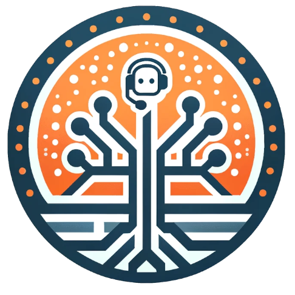

# Taskyon

<p align="center">
  
</p>

<h3 align="center">Research. Design. Reproduce.</h3>

Taskyon is an open-source, local-first design automation system for AI-assisted research, tool use,
and replayable engineering workflows.

The near-term goal is simple:

> Solve a design problem once through chat and tools, then make the successful process easier
> to inspect, replay, adapt, and eventually fork.

Taskyon is not trying to be another generic chat app. It is design automation software built around
a task tree: a structured record of questions, evidence, decisions, tools, parameters, and outputs
that can be inspected and reused.

## Why Taskyon

Technical design work rarely happens in a single tool. A real design automation process often mixes
chat, web research, documentation, spreadsheets, scripts, APIs, simulations, and human judgment. The
result may be useful once, but difficult to repeat.

Taskyon is built around the idea that successful design work should become reusable:

- inspect the task tree instead of losing structure in a flat chat log;
- keep sources, assumptions, prompts, artifacts, and outputs close to the work;
- identify parameters that should change between runs;
- separate AI interpretation from deterministic tools and human decisions;
- replay only the steps that need to change;
- compare variants;
- share and fork design workflows over time.

## Project Direction

Taskyon's design-automation path is intentionally incremental:

```text
research through chat
→ one viable design
→ parameterized task tree
→ replayable workflow
→ variants and comparison
→ deterministic execution dependencies
→ formal DAG
→ optimization and simulation
```

The first practical goal is reproducible design replay, not full autonomous engineering
optimization. Taskyon should help a person solve one concrete case, understand how it was solved,
and reuse parts of the process with different inputs.

## Example Workflows

Examples are meant to be guided design investigations rather than magic one-click solutions:

- **Local AI workstation**: budget, model requirements, VRAM, GPUs, power, cooling, noise, and
  local-versus-cloud break-even.
- **Mission drone**: payload, endurance, motors, propellers, ESC, battery, frame, cost, and safety
  margins.
- **Home battery system**: utility data, tariffs, solar, EV charging, battery sizing, scheduling,
  and investment tradeoffs.

These examples are starting points for forkable, inspectable workflows.

## What Exists Today

Taskyon already provides the foundations for open-source design automation:

- **Task-based conversations**: each message can become a task node in a navigable tree.
- **Local-first storage**: user data and task state stay local unless explicitly shared.
- **Tool execution**: tasks can call tools, functions, and model providers.
- **Research orchestration**: structured browser-research branches can delegate web search, page
  crawling, MCP-imported browser tools, and proxy-backed fetch fallbacks.
- **Browser access controls**: a dedicated Browser Access page configures browser MCP endpoints,
  startup guidance, chatCompletion web search, and proxy fallbacks for research workflows.
- **Sandboxed code execution**: run JavaScript/Python-style workflows in controlled environments.
- **File and context attachment**: attach artifacts and data to the working context.
- **Markdown and visual output**: render MathJax, Mermaid, SVG, HTML widgets, and rich technical
  documents.
- **LLM provider flexibility**: use OpenAI-compatible, hosted, or self-hosted model endpoints.
- **Web embedding**: integrate Taskyon into other pages or local workflows.

## What We Are Building Toward

The medium-term focus is turning useful conversations into reproducible design automation assets:

- parameter extraction and editing;
- task classification as deterministic, external-data, AI, or human steps;
- recorded replay and deterministic tool replay;
- source freshness policies;
- token/cost reporting;
- baseline verification;
- run diffs and variant comparison;
- template export/import;
- public design pages;
- sharing, forking, and eventually evaluator DAGs.

The long-term vision is a library of executable, forkable design automation workflows that can be
studied, challenged, improved, and reused with new parameters.

## Local First

Taskyon follows local-first principles wherever possible:

- **Data ownership**: workflows, drafts, and artifacts remain under user control.
- **Lower exposure**: data is not sent to external services unless a task or model call requires it.
- **Cost control**: deterministic replay should reduce repeated AI calls over time.
- **User autonomy**: workflows should remain useful outside a single hosted service.

## Try Taskyon

- Run locally with the development commands below.
- Documentation: [public/docs/index.md](public/docs/index.md)
- Broader chat and agent features: [docs/taskyon_chat_and_agent_features.md](/docs/taskyon_chat_and_agent_features)
- Feature comparison: [docs/taskyon_features.md](/docs/taskyon_features)
- DeepWiki notes: [](https://deepwiki.com/Xyntopia/taskyon)

## Development

Taskyon is a Yarn 4 monorepo for open-source design automation software using Quasar, Vue 3, Pinia,
Tauri, and shared Taskyon packages.

```bash
yarn install
yarn dev
```

Common commands:

- `yarn dev` starts the development app.
- `yarn build` creates a production build.
- `yarn test:e2e` runs the Playwright browser E2E suite.
- `yarn lint` runs typechecking and ESLint.
- `yarn format:file <path...>` formats specific files.

See `AGENTS.md` and `development_instructions.md` before making code changes.

## Contributing

Useful contribution areas include:

- design workflow templates;
- deterministic evaluators;
- data connectors;
- component catalogs;
- replay and comparison tools;
- visualizations;
- optimization and simulation integrations;
- verification datasets.

Join the Matrix channel: [Taskyon Matrix](https://matrix.to/#/!UNCbKcBpdEjFduzzMv:matrix.org?via=matrix.org)

## License

MIT. See `LICENSE.md` for details.
