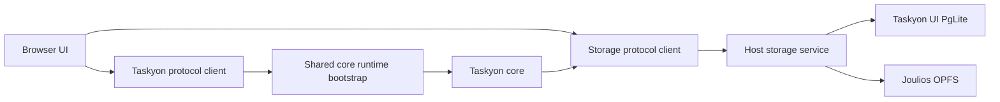

# Taskyon Browser Runtime

`@taskyon/runtime-browser` owns browser-side Taskyon core startup and its task-storage service
boundary. Browser applications choose a storage service; Taskyon core only receives a storage
protocol client.

## Runtime Modes

`createTaskyonBrowserCoreRuntime` starts the shared core bootstrap in the current JavaScript realm.
It returns the public Taskyon client, the generated storage client, and the direct Taskyon core
promise. The existing Taskyon UI uses this mode with its PgLite storage service because parts of
that UI still use trusted, direct core capabilities such as crypto-session switching, secret
management, and internal streams.

`createTaskyonBrowserRuntime` runs the same core bootstrap inside `coreWorker.ts`. The host keeps the
storage service and connects it to the worker through a `MessageChannel`. OPFS is the default worker
storage service, while callers can inject another protocol service.

Moving the full Taskyon UI to the worker mode requires promoting its remaining direct core
capabilities to explicit protocol services first. Applications that only use the public Taskyon
client can use worker mode without that migration.
