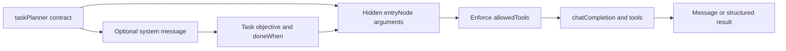

# `@taskyon/tycli`

Node-first Taskyon CLI for interactive chat and Node diagnostics.

The CLI registers host capabilities alongside Taskyon's shared model and workflow tools:

- workspace exploration and file reads;
- structured file updates;
- verified URL downloads;
- shell commands through `bash -lc`;
- `mapSearchTool` and `overpassMapTool` for OpenStreetMap and Overpass results;
- the active Taskyon documentation corpus;
- interactive clarification requests.

These tools operate in the environment where `tycli` is running. Use a container, VM, or other
sandbox when the model should not have direct access to the host workspace.

The CLI supports slash commands:

- `/keys`, `/provider`, and `/model`: configure model access.
- `/tools`: inspect registered tools.
- `/debug` and `/settings`: change CLI diagnostics and display behavior.
- `/client`: invoke the connected Taskyon client API.
- `/resume` and `/tree`: restore or inspect task history.
- `/exit` and `/quit`: end the session.

## Usage

From this directory:

```bash
yarn run
yarn cli-diagnostics --list
yarn cli-diagnostics --online
yarn cli-diagnostics:modelica
yarn discovery-fixture
```

From the repository root:

```bash
yarn tycli
yarn tycli:diagnostics
yarn tycli:diagnostics:list
yarn tycli:diagnostics:modelica
yarn tycli:discovery-fixture
```

Select provider explicitly:

```bash
TASKYON_SELECTED_API=openrouter.ai OPENROUTER_API_KEY=... yarn run
TASKYON_SELECTED_API=taskyon TASKYON_API_KEY=... yarn run
TASKYON_SELECTED_API=local TASKYON_LOCAL_API_KEY=local yarn run
TASKYON_SELECTED_API=chatgpt-codex yarn run
```

OAuth login helpers:

```bash
yarn run
/provider
```

Optional environment variables:

- `TASKYON_SELECTED_API`
- `OPENAI_API_KEY`
- `OPENROUTER_API_KEY`
- `TASKYON_API_KEY`
- `TASKYON_LOCAL_API_KEY`
- `TASKYON_CHATGPT_CODEX_API_KEY`
- `CHATGPT_CODEX_API_KEY`
- `TYAUTH`

Diagnostics defaults:

- `cli-diagnostics` reuses the same persisted `tycli` provider, model, API key, and OAuth login state by default.
- `TYAUTH` / `--tyauth` is only needed for Taskyon auth-token tests such as token minting/proxy coverage.
- `--provider` and `--model` override the stored `tycli` selection for a diagnostics run.

From the Nix dev shell:

```bash
tycli
```

This runs the built bundle from `packages/tycli/bin/tycli.cjs`, so it keeps working even if the current TypeScript sources are temporarily broken. Build it first with:

```bash
yarn tycli:build
```

For direct source-level testing without building:

```bash
tycli-dev
```

Type `exit` or `quit` to leave the chat.
Press Shift+Enter to insert a newline without submitting the prompt.

## Planner task contracts

`taskPlanner` can describe delegated work with a compact task contract:

```yaml
task: Inspect authentication boundaries
agentInstructions: Act as a cybersecurity reviewer.
allowedTools:
  - bash
doneWhen:
  - Every trust boundary has an evidence note.
result:
  mode: message
```

Taskyon renders task-specific behavior once as a system message and the objective/completion
criteria once as a user message. The hidden `entryNode` call carries the same contract for
continuation and result validation; it does not copy the contract back into model prompts.



For structured handoffs, set `result.mode` to `structured` and provide the JSON Schema for the
structured value. A completion produces one provider-derived message or one structured result; it
does not split one structured response into synthetic sibling messages. Keep large evidence in
persisted artifacts and put only summaries and artifact references in task results.

Sequential tasks receive terminal message and structured results even when those values are nested
inside entry-node execution chains. Internal prompts, function calls, and return nodes stay hidden.
Taskyon validates structured results against the contract schema.

`allowedTools` is an exact restriction, not a preference. Use an empty array for a handoff-only
synthesis or review task that should consume prior task results without making new tool calls.
When an objective names exact tools to call, include those tools in `allowedTools` so the delegated
task cannot select a broader workflow tool and duplicate the plan.

Planner groups are sequential by default. Use parallel groups only for independent work whose
results do not depend on each other. When parallel findings need one combined result, delegate an
outer sequential workflow: first run a research task that may call `taskPlanner` recursively for
parallel branches, then run an explicit synthesis task. Each delegated branch must surface a useful
message or structured result; `taskPlanner` does not insert implicit review tasks.

While work is running, `tycli` shows pending first-level sibling tasks above the thinking output.
The browser chat shows the same pending work in a compact expandable queue, grouped by parallel
branch.

## HTML previews

Browser Taskyon renders assistant HTML messages in sandboxed message iframes. A terminal cannot
embed that iframe, so `tycli` writes assistant HTML to a temporary preview file and prints a
clickable `file://` URL.

This applies to any HTML assistant message. For example, map tools can return an interactive
MapLibre or PMTiles view that can be opened from terminals supporting clickable links.

## Security

The shell and workspace tools can read and modify files visible to the process. Run the coding agent
in an appropriately scoped sandbox whenever possible. Running it directly on a host can cause
unintended filesystem changes, dependency conflicts, or other effects from model-generated
commands.
