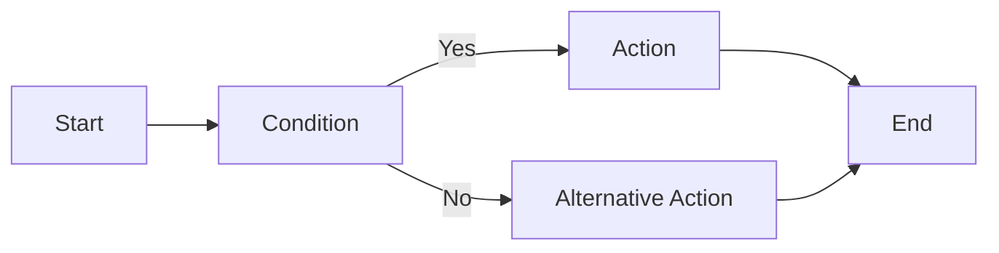
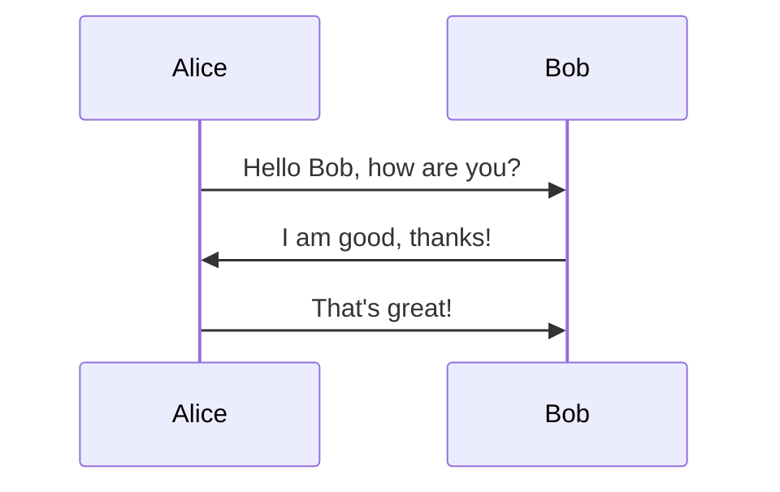
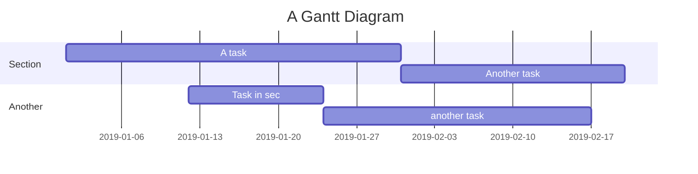

<!--taskyon
name: Showcase Taskyon's features
role: "user"
label: ["discard", "docs"]

-->

Can you showcase some of Taskyon's features?

---

<!--taskyon
role: assistant
label: ["discard", "docs"]
name: Showcase Taskyon's features
-->

I'd be happy to showcase some of my features.

**MathJax**

I can use MathJax to render mathematical formulas and equations. Here are a few examples:

- Inline formula: $x^2 + y^2 = z^2$

- Block formula:

$$

\frac{x^2 + y^2}{z^2} = 1


$$

- More complex equation:

$$

\begin{align*}

\dot{x} & = \sigma(y-x) \\

\dot{y} & = x(1-z) - y \\

\dot{z} & = xy - bz

\end{align*}


$$

**Mermaid Charts**

I can create a variety of diagrams, including flowcharts, sequence diagrams, Gantt charts, and more. Here are a few examples:

For more documentation, go to this webpage:

- **Flowchart**


```mermaid

graph LR
    A[Start] --> B[Condition]
    B -->|Yes| C[Action]
    B -->|No| D[Alternative Action]
    C --> E[End]
    D --> E
```

- **Sequence Diagram**


```mermaid

sequenceDiagram
    participant Alice
    participant Bob
    Alice->>Bob: Hello Bob, how are you?
    Bob->>Alice: I am good, thanks!
    Alice->>Bob: That's great!
```

- **Gantt Chart**


```mermaid

gantt
    title A Gantt Diagram
    dateFormat  YYYY-MM-DD
    section Section
    A task           :a1, 2019-01-01, 30d
    Another task     :after a1 , 20d
    section Another
    Task in sec      :2019-01-12 , 12d
    another task      : 24d
```

**Interactive Button Example**

You can also include interactive HTML elements. Here's an example of a button:

<button onclick="alert('Hello! This is a demonstration of a button click.')">Click Me!</button>

When you click the button above, it will display a simple alert message.

**Rendering code**

```python
def calculate_fibonacci(n: int) -> list[int]:
    """
    Calculate Fibonacci sequence up to nth number.

    Args:
        n: Integer number of sequence items
    Returns:
        List of Fibonacci numbers
    """
    result = [0, 1]
    while len(result) < n:
        result.append(result[-1] + result[-2])
    return result

# Example usage with different data types
numbers = calculate_fibonacci(10)
text = "Hello, World!"
flag = True
pi = 3.14159

# Dictionary with mixed types
config = {
    "name": "example",
    "values": [1, 2, 3],
    "enabled": True,
    "ratio": 0.75
}

print(f"Sequence: {numbers}")
```

These are just a few examples of what I can do with MathJax and charts. Let me know if you have any specific questions or if you'd like to see more examples!
