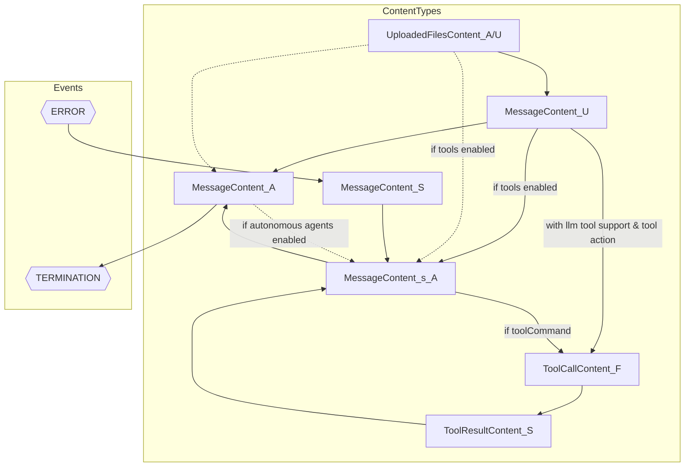

# How are tasks in Taskyon processed?

Every message/task in a "conversation" in taskyon has carefully designed
transitions which define what tasks/messages follow in the chain. This works similar to a state machine.

Inside the source code you can find that right now, there are three main parts to this:

- the taskworker runs the worker loop and executing each task is equivalent to generating a transition
- inside the taskworker there are:
  - the task processor
    - This processes each task and takes the tasks "content" as input and generates a "result"
    - the tasks content can be a function call, a simple message or structured data.
    - Based on the tasks content, the processor will also generate a prompts which cirect the LLM inference e.g. to create a specific data format in the response (json/yaml)
    - the output is the result of a function or another message
  - the follow up task generator creates new task(s) based on the result.
- if an error occurs a new task which holds the error as content is generated.

## Task Transitions Map

The Task Transitions Map illustrates the flow and transitions of various content types within taskyon, which operates as an agent. Each node in the diagram represents a specific type of task content. Depending on the content type, new tasks with specific content are created, leading to different processing paths.

#### Content Types:

roles: described with an underscore:

- \_A: Assistant/AI
- \_U: User
- \_S: System (e.g. used to report errors or uploaded files)
- \_F: Function (used for function execution)

- **MessageContent_A/U/S**: Represents a standard message content.
- **MessageContent_s_A/U/S**: Represents a message with structured content.
- **ToolCallContent_A/F**: Represents a content type that triggers a tool call.
- **ToolResultContent_F**: Represents the result content from a tool call.
- **UploadedFilesContent_s_U/A**: Represents a sub-type of uploaded files content.

#### Events:

- **TERMINATION**: Represents the termination of the conversation.
- **ERROR**: Represents an error event.

#### Other Conditions:

- LLM supports _tool calling_ (Like ChatGPT) in this case we can avoid structure responses in some
  situations

#### Workflow Description:

This diagram provides a clear visualization of how different content types are processed and how they interact within the AI system, ensuring a structured and efficient workflow.

What _kind_ of data we can encounter in a structured message (MessageContent_s_A) is determined by the previous
prompts. And those are determined by the kind of tasks which requests a structured Message....

- MessageContent_U -> tool prompt, if tools enabled
- ToolResultContent-F -> tool result prompt.
- MessageContent_S -> system prompt/error prompt

