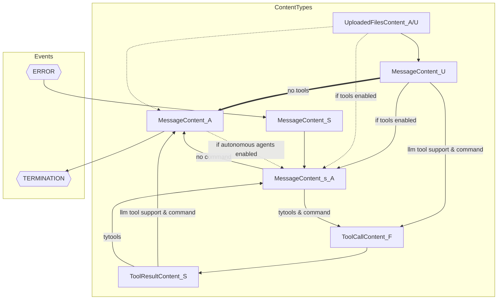
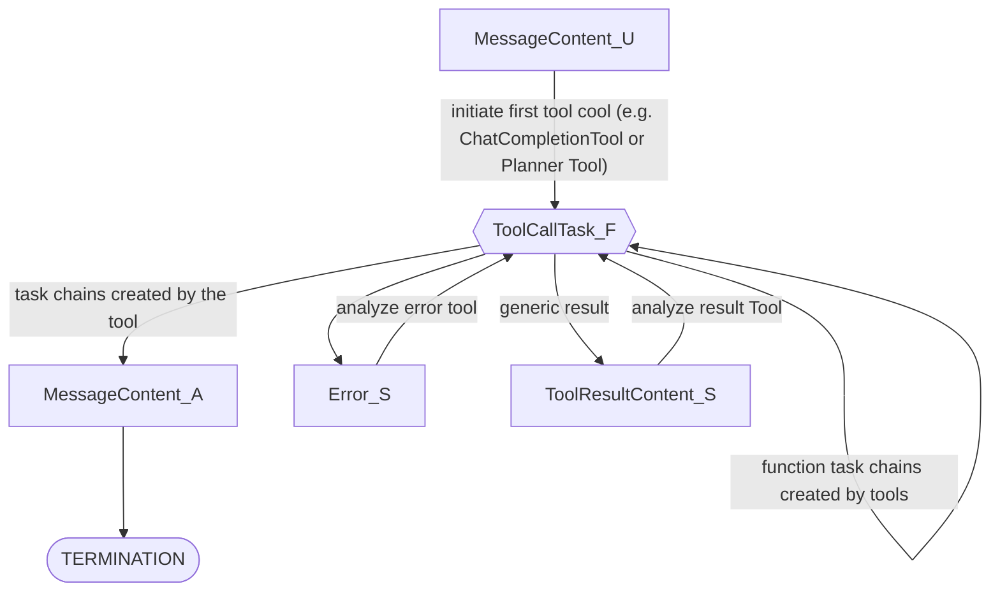
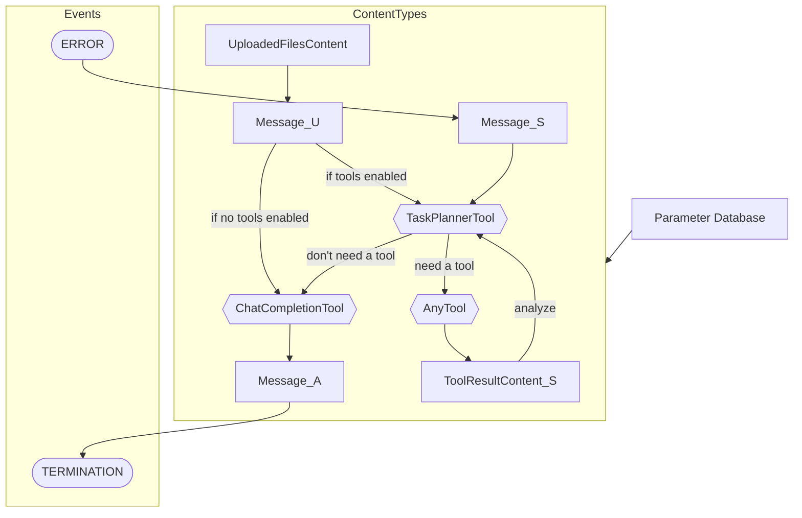

# How are tasks in Taskyon processed?

Every message/task in a "conversation" in taskyon has carefully designed
transitions which define what tasks/messages follow in the chain. This works similar to a state machine.

Inside the source code you can find that right now, there are three main parts to this:

- the taskworker runs the worker loop and executing each task is equivalent to generating a transition
- inside the taskworker there are:
  - the task processor
    - This processes each task and takes the tasks "content" as input and generates a "result"
    - the tasks content can be a function call, a simple message or structured data.
    - Based on the tasks content, the processor will also generate a prompts which direct the LLM inference e.g. to create a specific data format in the response (json/yaml)
    - the output is the result of a function or another message
  - the follow up task generator creates new task(s) based on the result.
- if an error occurs a new task which holds the error as content is generated.

## Task Transitions Map

The Task Transitions Map illustrates the flow and transitions of various content types within taskyon, which operates as an agent. Each node in the diagram represents a specific type of task content. Depending on the content type, new tasks with specific content are created, leading to different processing paths.

#### Content Types:

roles: described with an underscore:

- \_A: Assistant/AI
- \_U: User
- \_S: System (e.g. used to report errors or uploaded files)
- \_F: Function (used for function execution)

- **MessageContent_A/U/S**: Represents a standard message content.
- **MessageContent_s_A/U/S**: Represents a message with structured content.
- **ToolCallContent_A/F**: Represents a content type that triggers a tool call.
- **ToolResultContent_F**: Represents the result content from a tool call.
- **UploadedFilesContent_s_U/A**: Represents a sub-type of uploaded files content.

#### Events:

- **TERMINATION**: Represents the termination of the conversation.
- **ERROR**: Represents an error event.

#### Other Conditions:

- LLM supports _tool calling_ (Like ChatGPT) in this case we can avoid structure responses in some
  situations

#### Workflow Description:

This diagram provides a clear visualization of how different content types are processed and how they interact within the AI system, ensuring a structured and efficient workflow.

What _kind_ of data we can encounter in a structured message (MessageContent_s_A) is determined by the previous
prompts. And those are determined by the kind of tasks which requests a structured Message....

- MessageContent_U -> tool prompt, if tools enabled
- ToolResultContent-F -> tool result prompt.
- MessageContent_S -> system prompt/error prompt

For every tasknode except for the Functioncall tasknode which always has a "taskresult" node as a follow up task.
We need to make a decision, how to act on the data. This depends on several conditions. Mainly, if we use the built-in toolfunctionality for some AI services or if we use taskyons own tool functionality...
But also the structured data which was generated by the AI.

```mermaid
flowchart TD
    subgraph ContentTypes
        MessageContent_A[MessageContent_A]
        MessageContent_U[MessageContent_U]
        MessageContent_S[MessageContent_S]
        MessageContent_s_A[MessageContent_s_A]
        ToolCallContent[ToolCallContent_F]
        ToolResultContent_S[ToolResultContent_S]
        UploadedFilesContent[UploadedFilesContent_A/U]
    end

    subgraph Events
        TERMINATION{{TERMINATION}}
        ERROR{{ERROR}}
    end

    MessageContent_A --> TERMINATION
    MessageContent_U -- if tools enabled--> MessageContent_s_A
    MessageContent_U -- llm tool support & command--> ToolCallContent
    ToolResultContent_S -- llm tool support & command--> MessageContent_A
    MessageContent_U == no tools ==> MessageContent_A
    MessageContent_s_A -- no command --> MessageContent_A
    MessageContent_s_A --tytools & command--> ToolCallContent
    ToolCallContent --> ToolResultContent_S
    UploadedFilesContent --> MessageContent_U
    UploadedFilesContent -.-> MessageContent_A
    UploadedFilesContent -.if tools enabled.-> MessageContent_s_A
    ToolResultContent_S -- tytools --> MessageContent_s_A
    ERROR --> MessageContent_S
    MessageContent_S --> MessageContent_s_A
    MessageContent_A -. if autonomous agents enabled .-> MessageContent_s_A
```

### New Version where "everything is a tool"

In taskyon vesion 1.0.0 everything will be a tool including the chatcompletion.
Each tool can itself generate new follow-up tasks and thereby influencing
the shape of the task transition map. So the task processing now involves two layers:

- One layer represents the simple function execution chain.
- The second layer represents the transition between different types of function.
- the previous "structured" messages and all of that now are all handled by a tool which can
  implement its own logic to make conclusions about errors and whether we should use a tool
  for example

Here you can see how functions/toolcall processing becomes the center of how
taskyon works. The relevant parts in the taskyon code representing
this are the "runTaskWorker", "processTask" and "handleFunctionExecution" functions.

```mermaid
flowchart TD
    MessageContent_A[MessageContent_A]
    MessageContent_U[MessageContent_U]
    ErrorContent[Error_S]
    ToolCallContent{{ToolCallTask_F}}
    ErrorContent[Error_S]
    ToolResultContent_S[ToolResultContent_S]
    TERMINATION([TERMINATION])


    MessageContent_A --> TERMINATION
    ToolCallContent -- generic result --> ToolResultContent_S
    ToolResultContent_S -- analyze result Tool --> ToolCallContent
    ToolCallContent -- task chains created by the tool --> MessageContent_A
    ToolCallContent -- function task chains created by tools --> ToolCallContent
    ToolCallContent --> ErrorContent
    ErrorContent -- analyze error tool --> ToolCallContent
    MessageContent_U -- initiate first tool cool (e.g. ChatCompletionTool or Planner Tool) --> ToolCallContent
```

The second layer is easily extendible by defining new tools to fit your needs.
Taskyon provides a basic layer to get started with and which can automatically
incorporate new tools and generically analyze their results and use it.
When a task becomes more clear and repeats itself
often, it might make sense
to define a new tool which works faster on repeated
or complex tasks then trying to solve a problem
with the generic tools available.

The second layer depicts the transitions between
the actual tasks including what kind of tools are
being used in these transitions.

```mermaid
flowchart TD
  subgraph ContentTypes
    cct{{ChatCompletionTool}}
    tpt{{TaskPlannerTool}}
    at{{AnyTool}}
    Message_U
    Message_A
    Message_S
    ToolResultContent_S
    UploadedFilesContent
  end

  subgraph Events
      TERMINATION([TERMINATION])
      Error_S([ERROR])
  end

  paramdb["Parameter Database"] --> ContentTypes

  UploadedFilesContent --> Message_U
  Message_U -- if no tools enabled --> cct
  Message_U -- if tools enabled --> tpt
  tpt -- don't need a tool--> cct
  tpt -- need a tool --> at
  at --> ToolResultContent_S
  ToolResultContent_S -- analyze --> tpt
  Error_S --> Message_S
  Message_S --> tpt
  Message_A --> TERMINATION
  cct --> Message_A

```

This architecture can easily expanded in the future by adding new tools. E.g. we could add a Task planner tool
or a subtask planner tool and many more things.
