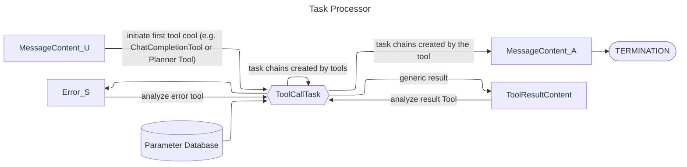
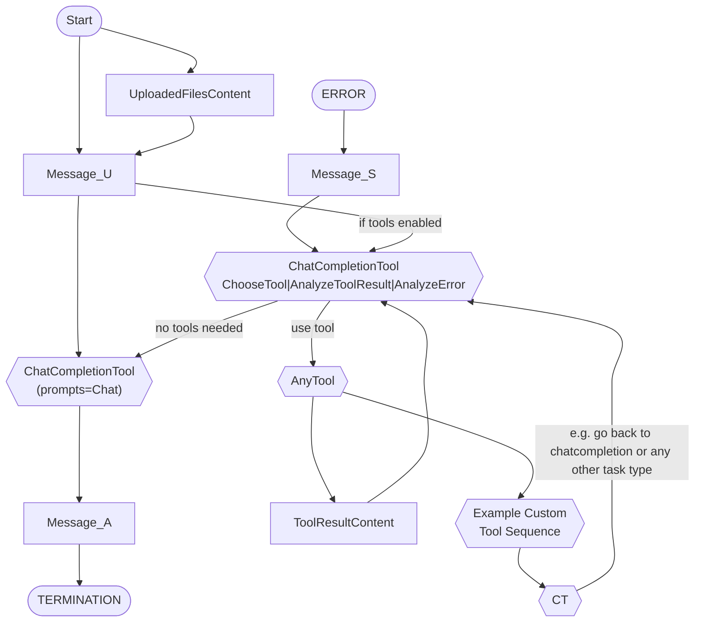
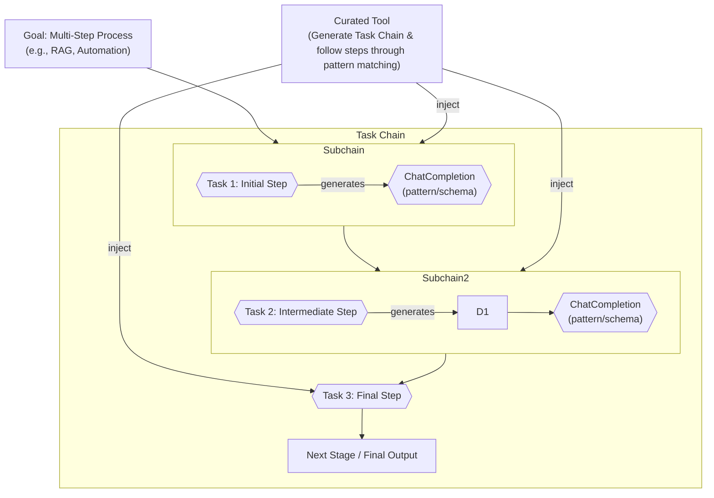

# How are tasks in Taskyon processed?

Every message/task in a "conversation" in taskyon has carefully designed
transitions which define what tasks/messages follow in the chain. This works similar to a state machine.

Inside the source code you can find that right now, there are three main parts to this:

- the taskworker runs the worker loop and executing each task is equivalent to generating a transition
- inside the taskworker there are:
  - the task processor
    - This processes each task and takes the tasks "content" as input and generates a "result"
    - the tasks content can be a function call, a simple message or structured data.
    - Based on the tasks content, the processor will also generate a prompts which direct the LLM inference e.g. to create a specific data format in the response (json/yaml)
    - the output is the result of a function or another message
  - the follow up task generator creates new task(s) based on the result.
- if an error occurs a new task which holds the error as content is generated.

## Task Transitions Map

The Task Transitions Map illustrates the flow and transitions of various content types within taskyon, which operates as an agent. Each node in the diagram represents a specific type of task content. Depending on the content type, new tasks with specific content are created, leading to different processing paths.

We expect all function calls to do three things:

- either return a result
- return a taskchain where the last task is a functionTask in order to signal further processing
- return a taskchain with the last task a "return" task.. which signals to the parent, that we're done and
  can return to the parent

#### Workflow Description:

In taskyon, the goal is that all functionality resides in tools defined in a
json structure. This helps taskyon to modify its own behaviour and makes AI
assisted tool development possible.
Each tool can itself generate new follow-up tasks and thereby influencing
the shape of the task transition map. So the task processing now involves two layers:

- One layer represents the simple function execution chain.
- The second layer represents the transition between different types of function.
- the previous "structured" messages and all of that now are all handled by a tool which can
  implement its own logic to make conclusions about errors and whether we should use a tool
  for example

Here you can see how functions/toolcall processing becomes the center of how
taskyon works. The relevant parts in the taskyon code representing
this are the "runTaskWorker", "processTask" and "handleFunctionExecution" functions.

```mermaid
---
title: Task Processor
config:
  flowchart:
    defaultRenderer: "elk"
---
flowchart LR
    m_a[MessageContent_A]
    m_u[MessageContent_U]
    ErrorContent[Error]
    tcc{{ToolCallTask}}
    ErrorContent[Error_S]
    ToolResultContent[ToolResultContent]
    TERMINATION([TERMINATION])


    tcc -- task chains created by tools --> tcc

    PD@{ shape: cyl, label: "Parameter Database" }
    PD --> tcc

    m_u -- initiate first tool cool (e.g. ChatCompletionTool or Planner Tool) --> tcc
    m_a --> TERMINATION
        tcc --> ErrorContent
    ErrorContent -- analyze error tool --> tcc
    tcc -- generic result --> ToolResultContent
    ToolResultContent -- analyze result Tool --> tcc
    tcc -- task chains created by the tool --> m_a


```

Taskyon provides a basic Taskflow to get started with and which can automatically
incorporate new tools and generically analyze their results and use it.
The chatCompletion tool in its current form takes the previous tasks and converts them into
an openAI API compatible list of messages, adds task-specific prompts and
then sends it to an openAI API compatible LLM Service (which can also be local).
When a task becomes more clear and repeats itself
often, it might make sense
to define a new tool which works faster on repeated
or complex tasks then trying to solve a problem
with the generic tools available.
If we unfold the graph from above and add the chatCompletion tool more explicitly.
We can see the transitions between different types of task in taskyons initial
configuration:

```mermaid
%%{init: { "flowchart": { "curve": "cardinal", "wrappingWidth": 400 } } }%%
flowchart TD
  Message_U
  Message_A
  Message_S
  ToolResultContent
  UploadedFilesContent
  cct{{"ChatCompletionTool<br>(prompts=Chat)"}}
  cctct{{"ChatCompletionTool<br>ChooseTool|AnalyzeToolResult|AnalyzeError"}}
  cct1{{"Example Custom<br>Tool Sequence"}}
  at{{AnyTool}}
  cct2{{CT}}


  TERMINATION([TERMINATION])
  e([ERROR])-->Message_S
  s([Start])

  Message_S-->cctct
  s-->Message_U
  s-->UploadedFilesContent --> Message_U --> cct --> Message_A --> TERMINATION
  Message_U -- if tools enabled --> cctct
  at-->ToolResultContent-->cctct
  cctct -- use tool --> at
  cctct -- no tools needed --> cct
  at --> cct1-->cct2-- e.g. go back to chatcompletion or any other task type -->cctct

```

### Comparison of taskyon's task sequence to a reduce function

The taskchain in the AI chat-app functions similarly to the "reduce" concept in functional programming, where each task builds upon the previous ones, maintaining context throughout the process. Here's a concise explanation:

1. **Function Execution and Context Accumulation:**

   - Each task in the taskchain receives all previous tasks as implicit arguments, allowing it to access the accumulated context and results from earlier tasks.
   - After executing, the task produces a new task that is added to the chain, representing the next step in the sequence.

2. **Similarity to Reduce Function:**
   - Like "reduce," the taskchain uses an accumulator concept, where each task processes the accumulated context (previous tasks) and produces a new state (the next task).
   - The process is sequential, with each step depending on the results of the previous steps, maintaining coherence and context.

This design allows the AI chat-app to handle complex interactions by chaining together simpler functions, each building on the previous tasks, much like how "reduce" processes elements to build up a result.

## Curated Tasks with Pattern Matching

A typical scenario is when you have a goal that requires several processing steps (e.g., RAG or process automation). Instead of writing a separate tool for each step, you create a single tool that handles the entire process. In Taskyon, this means building a chain of tasks where:

- **Curated Task Chain:** The tool outputs a list of tasks (like a flatmap in functional programming) that is then flattened into a continuous sequence.
- **Subtask Generation:** Each task can generate its own subtasks, keeping the chain flexible.
- **State Machine Behavior:** By using pattern matching on the previous task, the tool determines the next step, effectively acting as a state machine.

This approach lets you define the steps explicitly while leaving enough flexibility for Taskyon to determine transitions dynamically based on specific input/output needs.

Below is a mermaid chart illustrating this principle:

```mermaid
flowchart TB
  A["Goal: Multi-Step Process<br>(e.g., RAG, Automation)"] --> Subchain

  subgraph Task Chain
    direction TB
    subgraph Subchain
      direction LR
      C{{"Task 1: Initial Step"}}
      C2{{"ChatCompletion<br>(pattern/schema)"}}
      C -- generates --> C2
    end
    Subchain --> Subchain2
    subgraph Subchain2
      direction LR
        D{{"Task 2: Intermediate Step"}}
        D2{{"ChatCompletion<br>(pattern/schema)"}}
        D -- generates --> D1 --> D2
    end
    Subchain2 --> E
    E{{"Task 3: Final Step"}}
    G[Next Stage / Final Output]
  end

  E --> G

  B["Curated Tool<br>(Generate Task Chain & follow steps through pattern matching)"]
  B -- inject --> Subchain
  B -- inject --> Subchain2
  B -- inject --> E

```

In many cases, the steps are tightly coupled and require specific input and output data. With this single tool approach—leveraging flatmapping and state machine-like pattern matching—you avoid having to write separate tools for each step while maintaining clear, adaptable transitions.

TODO: add a json-example for a tool that can do this..
