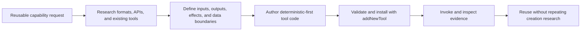

# Agent-Authored Tools

Taskyon agents can research, define, install, and verify new tools. The goal is not merely to save a
prompt. It is to turn a useful recurring procedure into a typed executable capability whose model
discretion, side effects, and data boundaries are explicit.

## Creation flow

A full guided creation run can compose three tools:

1. `toolCreationWizard` starts the guided workflow.
2. `toolSearcher` returns relevant installed tool definitions and source examples.
3. `addNewTool` validates the generated `ToolBase` and installs it through the tool manager.

The model selects the capabilities appropriate to the current request. It may call `addNewTool`
directly when a complete definition is already available, use the wizard when examples and guided
authoring are useful, or use separate research capabilities when the tool depends on an external
API or specification. Entry-node routing does not hardcode this sequence.

The agent should then invoke the installed tool with representative inputs and inspect its result.
Installation alone does not prove that the implementation works.

## Deterministic-first authoring

Implement parsing, validation, calculations, normalization, commands, and known decision rules in
ordinary code. Use `chatCompletion` only when the tool needs semantic judgment that cannot be
expressed correctly and maintainably as code. Keep that call visible in the returned task chain and
state the condition that triggers it.

For example, a legislation tool can retrieve an identified provision, preserve its exact text,
record the source URL, and report its retrieval date without a model. It may create a
`chatCompletion` task only when the user supplies a vague topic or explicitly requests a summary.

Use structured clarification for genuinely missing required inputs. Do not ask questions whose
answers can be derived safely from the supplied arguments or authoritative source.

## Researching APIs and procedures

Prefer authoritative machine-readable contracts such as OpenAPI, JSON Schema, XML schemas, or
documented command output. Record important rate limits, authentication requirements, licenses,
version behavior, and required identifying headers. For targeted retrieval, prefer official APIs
and feeds over brittle HTML scraping; parse HTML only when the authoritative source offers no
stable structured representation.

The generated parameter schema should expose the smallest useful contract. It should not mirror an
entire upstream API when the tool owns a narrower capability.

## Code and workflow shape

- Return a plain structured result for one deterministic operation.
- Use `context.createSubtasksResult(...)` when sequence, parallelism, tool calls, clarification,
  model decisions, approval, or completion must remain visible.
- Call privileged host capabilities through explicit child tools instead of hiding shell, file,
  network, or UI effects inside opaque code.
- Keep long-running state in task arguments, visible task results, or persisted artifacts.
- Honor `context.stopSignal` and return errors that identify the failed operation.

See [Tool and Workflow Authoring](tools-and-workflows.md) for the current runtime contract.

## Installation, identity, and replacement

An installed tool has a named active revision. Installing identical content is idempotent. Replacing
an existing active revision requires explicit approval; agents should not silently overwrite a
user's working tool. Use stable names for durable capabilities and isolated storage for experiments
rather than generating many timestamped names in a shared registry.

For `tycli` E2E experiments, set `TYCLI_DATA_DIR` to the run's data directory. This isolates all
Taskyon `StorageClient` records and blobs, including generated tools, tasks, artifacts, and
transcripts, while retaining the normal saved provider, model, and OAuth configuration.

## Security and verification

- Treat generated code and imported skill scripts as dependencies that require review.
- Grant only the network, file, secret, popup, and host capabilities the tool needs.
- Never embed credentials in a definition, trace, result, or example.
- State which data remains local, reaches a model, or reaches an external service.
- Separate exact source material and solver evidence from model-generated interpretation.
- Verify repeatability and test the lowest-model-discretion path independently.
- Measure creation-phase model calls separately from later tool invocations.

Agent-authored tools remain subject to the same schemas, sandbox, permissions, replacement rules,
and verification expectations as human-authored tools.
