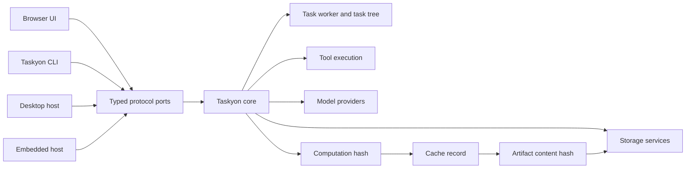

# Architecture

Taskyon separates execution from the environments that host it.

- **Taskyon core** owns task processing, tool contracts, model orchestration, and protocols.
- **Protocols** expose task, tool, file, archive, peer, GUI, and storage operations over typed
  ports.
- **Hosts** provide browser UI, CLI, iframe, desktop, storage, secrets, and external tools.
- **Task trees** record execution using immutable nodes connected by `priorID` and `parentID`.
- **Storage services** keep persistence behind explicit record/file interfaces.

The browser application and `tycli` should use the same core contracts. Runtime-specific
capabilities must be optional or registered by the host; shared core code must not import Node-only
or browser-only shortcuts.

The supported integration boundary is `@taskyon/taskyon/api`, not the broad internal root export.
Architectural design proposals are maintained outside the frontend repository.

## Protocol services

`taskyonProtocol` is a merged FRP protocol with service-scoped commands and streams:

- `peer`: readiness and lifecycle;
- `task`: task reads, chain selection, creation, and update events;
- `tools`: discovery, registration, calls, responses, and cancellation;
- `files`: file registration;
- `archive`: task export/import;
- P2P services for peer and address operations.

Wire command names remain flat, while `createPortClient` exposes a nested client such as
`client.task.get(...)`. Service names are composed by the protocol helper; command definitions
should not manually repeat the service prefix.

`taskyonGuiProtocol` extends the core protocol with host/UI configuration. Public task clients,
privileged host operations, and individual tool executors should remain separate capabilities.
Secret, profile, session-key, destructive storage, and index-reset operations do not belong in the
ordinary public protocol merely because direct core methods still exist.

`taskyonStorageProtocol` transports record namespaces, keys, and values without interpreting their
identity or prescribing physical paths. Domain owners provide canonical hashes when identity comes
from immutable content or a computation. Filesystem backends store records under fixed-length,
Git-style hash paths while databases, object stores, and peers preserve the same protocol contract.

A DAG cache record maps a computation hash to an artifact content hash. The computation hash is
derived from the node identity and parameters and answers whether work was already performed. The
artifact hash is derived from the exact serialized result and independently verifies bytes loaded
locally or received from a peer. These hashes cannot be collapsed while computations may observe
external state or otherwise produce different outputs.

## Message-port boundary

Iframe and Worker integrations transfer a `MessagePort` once to establish a private sandbox
transport. A lightweight shared kernel owns request correlation, results, errors, cancellation, and
termination. Generic callers use the executable-sandbox API; FRP services add validated typed
protocol clients on top. Neither normally exposes the native channel to application code.

Tool/UI interaction is an explicit host capability. Sandboxed tools do not receive a raw
`MessagePort`, parent window, or generic event bus.

The long-term direction is maintained in workspace-level architectural proposals. Current code is
still migrating direct `tyCore()` methods to protocol services one operation at a time.
