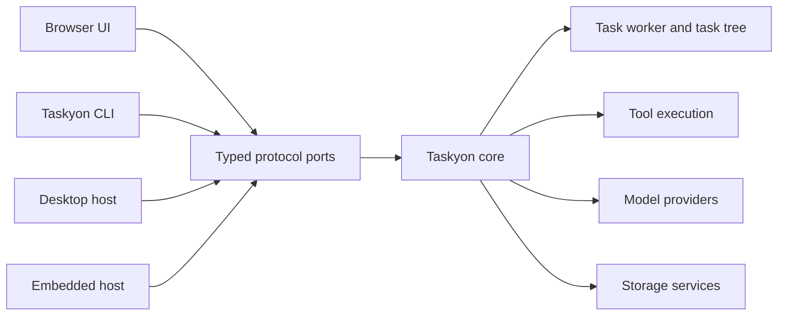

# Architecture

Taskyon separates execution from the environments that host it.

- **Taskyon core** owns task processing, tool contracts, model orchestration, and protocols.
- **Protocols** expose task, tool, file, archive, peer, GUI, and storage operations over typed
  ports.
- **Hosts** provide browser UI, CLI, iframe, desktop, storage, secrets, and external tools.
- **Task trees** record execution using immutable nodes connected by `priorID` and `parentID`.
- **Storage services** keep persistence behind explicit record/file interfaces.

The browser application and `tycli` should use the same core contracts. Runtime-specific
capabilities must be optional or registered by the host; shared core code must not import Node-only
or browser-only shortcuts.

The supported integration boundary is `@taskyon/taskyon/api`, not the broad internal root export.
Architectural design proposals are maintained outside the frontend repository.

## Protocol services

`taskyonProtocol` is a merged FRP protocol with service-scoped commands and streams:

- `peer`: readiness and lifecycle;
- `task`: task reads, chain selection, creation, and update events;
- `tools`: discovery, registration, calls, responses, and cancellation;
- `files`: file registration;
- `archive`: task export/import;
- P2P services for peer and address operations.

Wire command names remain flat, while `createPortClient` exposes a nested client such as
`client.task.get(...)`. Service names are composed by the protocol helper; command definitions
should not manually repeat the service prefix.

`taskyonGuiProtocol` extends the core protocol with host/UI configuration. Public task clients,
privileged host operations, and individual tool executors should remain separate capabilities.
Secret, profile, session-key, destructive storage, and index-reset operations do not belong in the
ordinary public protocol merely because direct core methods still exist.

## Message-port boundary

Iframe and host integrations transfer dedicated `MessagePort` endpoints. Protocol servers validate
the message schema, and tool RPC correlates calls, responses, timeouts, cancellation, and task
context. Host applications should register explicit client tools instead of exposing the parent
window or a generic event bus.

The long-term direction is tracked in the workspace-level
`proposals/sandboxed-core-protocol.md` design document. Current code is still migrating direct
`tyCore()` methods to protocol services one operation at a time.
