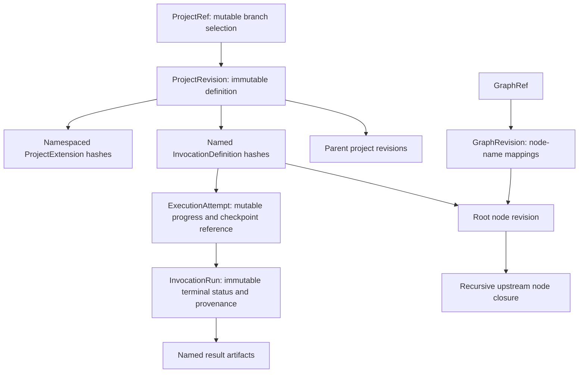

# Design Graphs And Workspaces

Taskyon's design-graph implementation is shared by browser and Node hosts. `@taskyon/comp-dag`
owns graph identity, traversal, stored-node compilation, invocations, runs, repository persistence,
and Git projections. `@taskyon/ui` owns reusable graph and workspace interactions. Host
applications provide composition, labels, commands, and storage capabilities.

## Node identity and origin

There are two supported definition origins:

- `hard-coded` nodes are supplied by a trusted runtime;
- `stored` nodes are loaded from TypeScript source in the writable design-graph repository.

Both compile to the same `DagNode` execution type. Stored nodes are content addressed and editable
through immutable replacement; imported bundles and Git repositories are import sources, not a
third read-only node category.

Stored source may use static imports when the node references an immutable module lock. The lock
maps every referrer/specifier pair to an exact content-addressed module object, so browser, CLI,
Git, and StorageClient execution use the same dependency closure without storing `node_modules`.
Import-free nodes do not carry an empty lock.

`use.<alias>` is reserved for declared DAG dependencies. Network access is exposed as
`services.fetch`; the host mediates HTTPS requests and authorizes them by node hash, origin, and
read/write access. A compiled node reuses the authorization for repeated rows in that execution
context.

Definition origin is independent from execution effect. A `pure` node computes only from declared
inputs, while a `source` node observes an external environment. A stored node may be pure or a
source, and a hard-coded node may be pure or a source. Graph presentations therefore carry both
`definitionOrigin` and `isSource` rather than encoding either fact in one color or label.

`dagNodeRecordGraph.ts` owns stored-record indexing, closure and relation traversal, deletion
planning, immutable input rewrites, default merging, and graph compilation. `dagGraphView.ts`
projects runtime nodes into presentation data; it is not the compiler or repository.

## Source observations

Source nodes use immutable `SourceLockManifest` records to bind one observation to the exact node,
acquisition key, parameters, artifact, and timestamp. The source execution configuration selects a
refresh policy:

- `none` and `manual` reuse an existing manifest unless explicitly forced;
- `stale` refreshes after its configured duration;
- `always` refreshes once per execution run.

Projects may pin a source manifest without changing the immutable manifest itself. The environment
diagnostics classify definite source nodes and potential pure leaves so a host can explain which
values come from observations and which may still need user-supplied data.

## Repository object model

The StorageClient-backed design repository stores one shared immutable object pool:

```text
nodes/<content-hash>.ts
modules/<content-hash>.json
module-locks/<content-hash>.json
graph-revisions/<content-hash>.json
project-revisions/<content-hash>.json
invocations/<content-hash>.json
extensions/<content-hash>.json
refs/<ref-name>.json
```

A graph revision maps names to immutable node hashes. A project ref points to a project revision;
the revision records parent hashes, a display name, friendly invocation names, and namespaced
extension hashes. Each invocation selects its computational root and input domains. Projects share
the global node pool and do not own copied node catalogs.

The paths above are the internal StorageClient layout. A checked-out source tree uses readable,
deterministic aliases for the same immutable objects. Node files use `localName` first, while graph
revisions, project revisions, invocations, extensions, modules, and locks use names available from
refs and metadata. If two objects would receive the same path, the projector appends the first eight
characters of that object's hash, for example:

```text
nodes/FeasibilitySummaryNode--8iH7Wt-x.ts
graph-revisions/main.json
project-revisions/Feasibility-Summary-Rectangle-Real-Weather.json
```

These names are presentation only. They are not a manifest and do not replace embedded Taskyon
hashes. Node input fields continue to reference hashes. The checkout adds generated comments beside
those references, such as `source -> SolarResourceNode — Solar resource`; comments are explanatory
projection text and are excluded from node identity. When a named node is edited, import recomputes
its hash, rewrites affected downstream input references, creates new immutable graph/project
revisions, and advances the checked-out refs conditionally.

Source-observation locks currently use the separate `SourceManifestRepository` over logical
StorageClient namespaces. The Git projection recognizes a `source-manifests` directory, but project
snapshots do not infer source locks from a computational closure.

Execution attempts contain mutable progress and checkpoints. A terminal `InvocationRun` contains
resolved execution identity, status, provenance, and named artifact hashes. Row artifacts and
their access index remain streamable so consumers do not need to materialize an entire study in
memory.

## Project And Invocation Vocabulary



Project extensions are typed, content-addressed definitions for deliberately saved dashboards,
workspaces, and other application-specific configuration. They are not copies of graph nodes or
result stores. Invocation roots select computational closures independently of graph catalog refs.
An invocation may be presented as a single design, study, or optimization based on its domains and
objectives; these are not separate invocation record types.

### Current Behavior And Target Gaps

The current `ExecutionAttempt` already has mutable progress, optional `totalRows`, and an optional
`checkpointArtifactId`. `InvocationRun` stores status, timings, resolved policy, provenance, and
named artifacts. The current writer stores NDJSON rows plus a row index; its summary contains row
count/status. It does not implement durable planner resumption simply because a checkpoint field
exists. The separate node cache already maps computation keys to node-output artifacts.

The execution policy requires source-aware deterministic row reuse. Current node/parameter cache
lookup still needs dependency traces and snapshot validation to meet that invariant. Source locks
currently live outside `InvocationDefinition`; `sourceSnapshotId` and the proposed name
`InvocationAttempt` are not current API fields/types. Proposed final row-count and stopping-reason
fields would move small lifecycle facts onto the run itself. Dataset partitions, richer progress,
generic template ingestion, and invocation-backed document rendering remain future work.

The target excludes aliases, project IDs, run IDs, and worker completion order from computation
identity. Exact parameters, pinned root implementation, and consumed source observations determine
each result. A new source never consumed by prior rows may extend an invocation snapshot without
invalidating those rows. Counts before and after expansion must remain distinct; unavailable or
estimated totals must explain why. See the repository's design-graph execution policy for durable
invariants; this section does not imply those target capabilities have shipped.

## Git projections

Git is a synchronization projection above the authoritative StorageClient repository, not a
StorageClient backend. `projectDesignGraphSnapshot` can project:

- the complete global repository;
- one project ref with its revision ancestry, invocations, extensions, and node closure;
- one graph revision with its ancestry and node closure;
- one node and its upstream closure.

Imports validate paths, schemas, content hashes, and closure references. Immutable objects are
written before refs, and refs use expected-current conditional writes. Synchronization only
fast-forwards: equal histories are unchanged, an ahead side is pushed or pulled, and divergent
histories return `conflict` without an automatic merge.

Static browser hosts may include a generated `repository-index.json`. It is only a list of files so
the browser can enumerate a checkout over HTTP; it is not a hash-to-name manifest or part of graph
identity. Browser and Node readers resolve both readable checkout paths and internal hash-addressed
paths during migration and import.

Node and graph snapshots include the transitive module-lock/module closure of every imported
stored node.

The browser adapter uses isomorphic-git with a private IndexedDB working tree. The Node adapter
uses a normal Git working directory. Both implement the same `DesignGraphGitSynchronizer` contract
and feed the same projection/import logic.

`DesignGraphGitSyncPane.vue` is the reusable UI boundary. The host owns its settings and injects a
`synchronize` function for the chosen snapshot selector. Authentication values stay transient;
the pane does not import a host store or persist credentials.

## Reusable graph views

`GraphCanvas.vue` renders generic `GraphData`. Its `GraphPresentationState` contains the stable
layout choice plus pan/zoom and node-drag preferences. Hosts may persist that small configuration
at their composition boundary while keeping selection, search, filters, camera position, and
temporary visibility local.

`GraphCanvasControls.vue` provides flow, vertical, and organic layouts, per-node visibility,
pan/zoom, node dragging, fit-visible, focus-selected, PNG copy, and SVG export.

`DagGraphExplorer.vue` composes the canvas with tree, graph, and list modes. It owns local search,
filtering, list selection, and context-menu positioning. Hosts opt into node creation and inject
toolbar, batch, node-action, and context-menu slots; the reusable component does not assume a
domain-specific create or delete policy.

## Workspace composition

`DockView.vue` supports leaf regions named `navigation`, `document`, and `tools`. A split inherits
the target region unless the host explicitly chooses another one, so opening a document does not
depend on whichever pane happened to be focused most recently. The add-pane menu searches the
host-provided view catalog.

`WorkspaceShell.vue` groups workspace entries by an optional `section` and supports an expanded or
compact navigation rail. Reusable panes do not import application-wide stores. The top-level page
or workspace host owns persisted widget configuration and passes each pane only its relevant
state and actions.

## Package boundaries

- `@taskyon/common/modules/graph` owns generic graph data, layout mapping, rendering, and
  presentation-state types.
- `@taskyon/comp-dag` owns computational DAG semantics and graph repository algorithms.
- `@taskyon/ui` owns reusable Vue graph, editor, Git-sync, and docking components.
- browser and Node packages own their storage, sandbox, and Git adapters.
- host applications own product navigation, project defaults, domain filters, commands, markers,
  and theme values.

Use package exports rather than relative imports across these boundaries. The packages remain
experimental, so their current source exports are not a stable third-party API.
