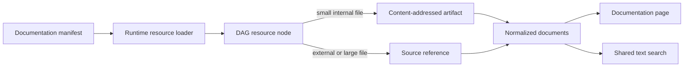

# Documentation Bases

Taskyon treats documentation as manifest-backed bases. The built-in Taskyon base is available at
`/docs/taskyon`; registering another manifest creates another route under `/docs/<base>`.

The documentation page can import and export manifest JSON. Manifests are persisted through the
generic `StorageClient`: browser hosts use their selected record provider, while `tycli` uses its
configured file, SQLite, or PGlite record provider. Documentation code sees the same logical
namespace in every runtime.

## Manifest contract

A manifest has `internal` and `external` arrays. Each entry is a source URL or a named chapter
whose value contains more entries. The object keys define the visible chapter hierarchy and array
order defines document order.

```json
{
  "internal": [
    {
      "Guides": ["/docs/getting-started.md", "/docs/workflows.md"]
    },
    { "API": ["/resources/peers/local/api"] }
  ],
  "external": ["https://example.com/reference.pdf"]
}
```

Sources may resolve to individual files or directories. The runtime resource loader expands
directories recursively and converts supported files to searchable text. Markdown titles come from
the first H1, with the filename as a fallback; manifests do not require YAML frontmatter, document
IDs, or duplicated titles. The loaded resource path becomes the exact document ID used for lookup;
the viewer does not rewrite extensions or resolve aliases.

## Loading and caching

The resource loader materializes each source once and passes it through the generic DAG resource
node. Internal files up to the node's `maxInlineBytes` limit are stored as content-addressed DAG
artifacts. External files and larger internal files remain references. The DAG backend itself uses
content-agnostic `StorageClient` records under `dag/artifacts` and `dag/cache`.

`internal` therefore means that a source is eligible for local artifact caching, not that it must
be bundled with Taskyon. `external` always preserves a source reference.



## Search and generated API documentation

The documentation page and the generic `documentationIndex` tool call the same shared search
function. Search is local and supports literal text or an explicit regular expression; it does not
build a vector index. Clearing the page filter restores the complete manifest tree.

The Taskyon manifest also includes the local peer discovery endpoint. At runtime that endpoint
publishes the peer's OpenAPI document, including its registered tools. The generic loader keeps the
complete OpenAPI JSON as one searchable document. Documentation tools read that JSON directly,
while the documentation page renders the same content with the reusable OpenAPI viewer.

Search results link to `/docs/<base>/<document>`. Markdown links remain relative to the selected
base, so the same authored documents can be reused by multiple documentation bases.
