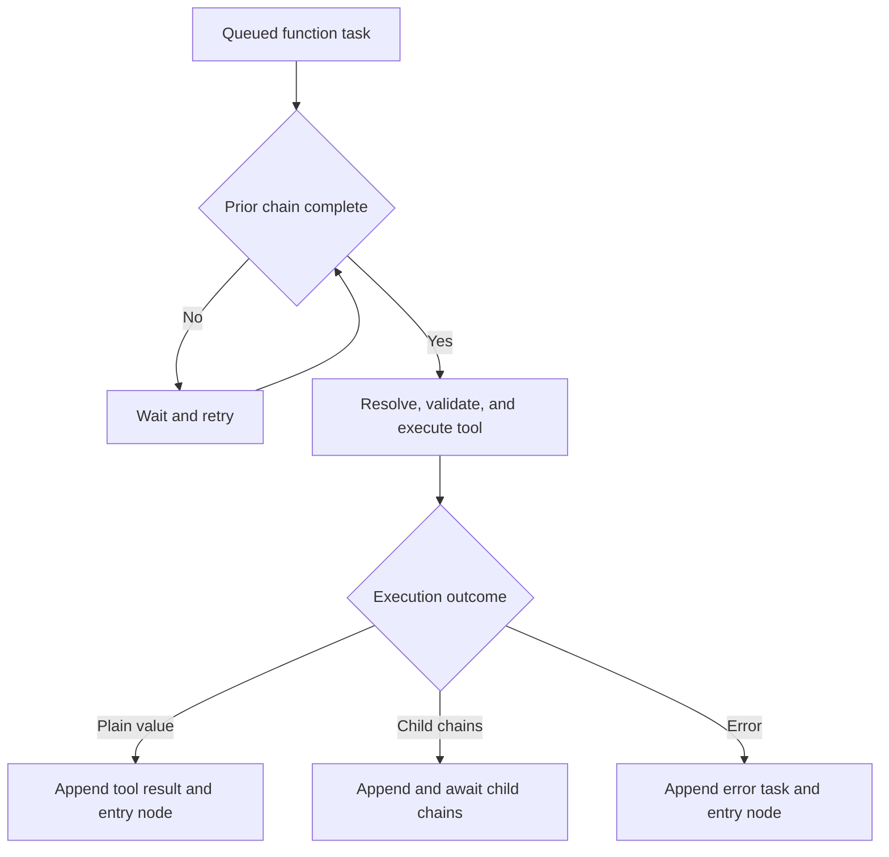
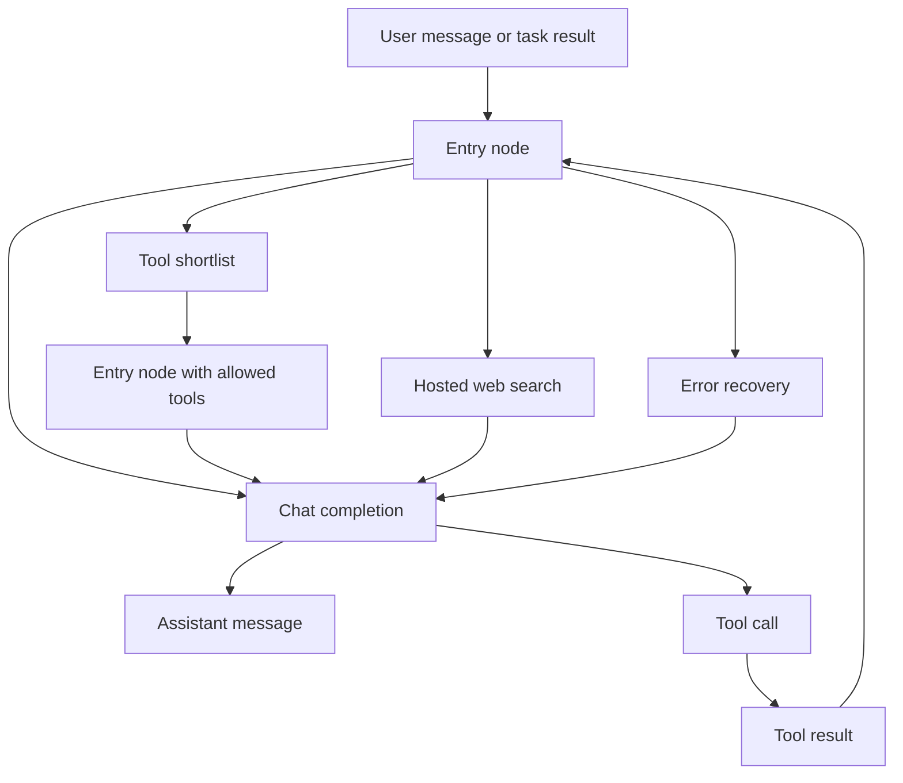

# Task Processing

## Task nodes

Taskyon appends immutable `TaskNode` records. The core content types are:

| Type             | Purpose                                                   |
| ---------------- | --------------------------------------------------------- |
| `message`        | User, assistant, or system text with optional annotations |
| `structured`     | Machine-readable data                                     |
| `functioncall`   | A named tool invocation and JSON arguments                |
| `toolresult`     | A plain tool result                                       |
| `error`          | A processing or tool failure                              |
| `files`          | File IDs registered with the file service                 |
| `tooldefinition` | A stored tool contract                                    |
| `return`         | Explicit completion of one child chain                    |

`priorID` links the previous task at the same sequential level. `parentID` links a child task to the
`functioncall` that created its chain. The schema also has optional author, ACL, and signature
fields; runtimes must not claim authorization guarantees unless they actually verify and enforce
them.

## Worker flow

Only `functioncall` tasks execute. The task worker waits for the prior chain to finish, resolves the
tool, applies schema defaults and configured tool settings, materializes task-variable references,
and executes the tool through the appropriate local, sandbox, or remote boundary.

A tool has two result paths:

- A plain value becomes a `toolresult`, followed by the configured entry node.
- `ctx.createSubtasksResult(...)` appends one or more explicit child chains.

Errors become `error` tasks and return to the entry-node recovery path. A workflow must bound
retries and change the failing condition; repeatedly issuing the same call creates an unproductive
tree.



## Sequential and parallel chains

`createSubtasksResult` accepts a task, one task array, or an array of task arrays:

```ts
return ctx.createSubtasksResult([
  [
    toolCall({ name: 'fetchInput', arguments: {} }),
    toolCall({ name: 'analyzeInput', arguments: {} }),
    { role: 'system', content: { type: 'return', data: 'analysis complete' } },
  ],
  [
    toolCall({ name: 'checkConstraints', arguments: {} }),
    { role: 'system', content: { type: 'return', data: 'constraints checked' } },
  ],
])
```

Tasks inside one inner array receive sequential `priorID` links. Separate inner arrays share the
spawning `functioncall` as their parent and can execute independently. The parent is complete after
all of its child chains finish.

Use `return` as a control signal, not as the primary data channel. Put output in the preceding
`message`, `structured`, or `toolresult` task so reducers and context selection can find it.

## Tasks as reducers

An executable task should be treated as a reducer:

```text
next tasks = reducer(selected task projection, explicit arguments, persisted artifacts)
```

Task trees aim to make workflows reproducible by aligning their composition with functional
programming where practical. External effects such as files, processes, networks, and user actions
cannot always produce the same result when repeated. Keep those effects explicit at tool and
runtime boundaries, and record the arguments, observations, results, and decisions that matter in
the tree.

Workflow progress belongs in visible tasks, explicit arguments, or durable storage. Do not keep an
important plan, loop counter, intermediate decision, or retry state only in a long-running tool
closure. A resumable iterative workflow normally has:

```text
controller -> parallel batch -> evaluator/reducer -> continue or return
```

## Context selection

Taskyon core provides neutral task storage and traversal. Each tool owns the projection and
interpretation required by its reducer; core must not impose an LLM-specific context policy or
import a concrete tool implementation.

`getExecutionTaskChain()` loads the context selected by the executing tool. `chatCompletion`
supports two traversal strategies:

- `flattened` follows the broader execution tree, with optional limits.
- `lineage` follows the current lineage and can add visible terminal results from direct child
  branches.

`lineage` with `includeSubtaskResults: 'terminal-visible'` includes terminal `message`,
`structured`, `toolresult`, and `error` values, or the visible value immediately before a `return`.
Tool render options can hide tasks from chat, the LLM, or vector indexing.

Context is part of the workflow contract. Select the evidence required by the next reducer instead
of flattening every nested task into every model request.

## Entry nodes

The entry node is the workflow router used after a user message, plain tool result, structured
result, or error. The standard entry node decides whether to:

- answer through `chatCompletion`;
- expose provider-native tool calling;
- run a structured tool-shortlist phase;
- recover from a failed tool call;
- ask structured clarification questions;
- enable configured hosted web search.

Entry-node settings own prompt templates, default tools, tool-choice behavior, reasoning,
multimodal input, and web-search flags. `chatCompletion` remains the model gateway.

When tool choosing is enabled and the available tool count exceeds `tool_chooser_min_tools`, the
shortlist phase runs a `chatCompletion` that exposes and forces only the current entry node. The
model calls that entry node with a narrowed `allowedTools` list. The new entry node inherits the
preceding entry node's other deterministic settings and performs the next tool-selection step; no
intermediate structured routing result is added to the task chain.

Use a custom entry node when a page needs domain context, deterministic routing, or a deliberately
narrow tool set. Keep its top-level branch visible in the tool function rather than hiding the
workflow shape behind wrappers.



## Client settlement

`client.runTasks(taskChains, quitCondition, options)` returns the first matching task and throws on
error, abort, or timeout. `processTasksDetailed(port)` instead returns a settlement object with
`matched`, `error`, `aborted`, or `timeout` status plus all observed tasks. Always provide a timeout
or cancellation signal for external callers.
