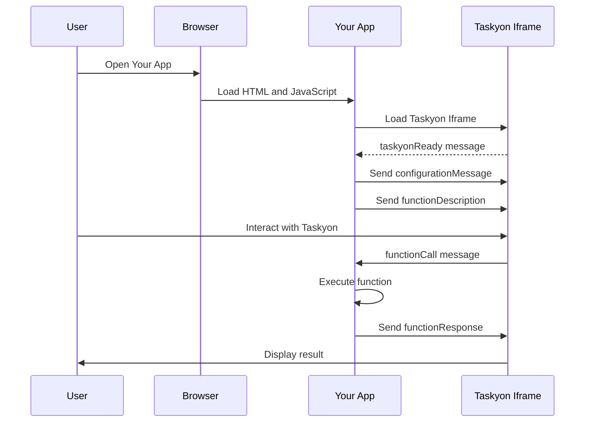

<!--taskyon
name: How to integrate Taskyon into a webpage
role: "user"
-->

How do I integrate taskyon into my own webpage?

---

<!--taskyon
role: assistant
-->

Hi, this is not hard! You can integrate taskyon as an iframe. You have full control
over how taskyon interacts with your webpage and what data you exchange. You also don't
need to do anything in your backend!

Here is a little example to get started:

[https://codepen.io/xyntopia/pen/VwJvrLo?editors=1010](https://codepen.io/xyntopia/pen/VwJvrLo?editors=1010)

Scroll further down in the chat to get more explanations.

---

<!--taskyon
name: How does Taskyon integration work?
role: user
-->

can you create a sequence diagram
for me, how taskyon communicates with an app/webpage which integrates it as an iframe?

---

<!--taskyon
role: assistant
-->

Sure! Below is a sequence diagram that illustrates how Taskyon communicates with an app that integrates it as an iframe.



### Explanation

1. **User Interaction**: The user opens your app in a browser.
2. **App Initialization**: The browser loads the HTML and JavaScript files of your app.
3. **Taskyon Iframe Loading**: Your app loads the Taskyon iframe.
4. **Taskyon Ready**: Taskyon iframe sends a `taskyonReady` message to your app.
5. **Configuration Message**: Your app sends a `configurationMessage` to Taskyon iframe.
6. **Function Description**: Your app sends a `functionDescription` to Taskyon iframe.
7. **User Interaction with Taskyon**: The user interacts with Taskyon through the iframe.
8. **Function Call**: Taskyon sends a `functionCall` message to your app.
9. **Function Execution**: Your app executes the corresponding function.
10. **Function Response**: Your app sends a `functionResponse` back to Taskyon.
11. **Display Result**: Taskyon displays the result to the user.

---

<!--taskyon
name: Step-by-step tutorial
role: user
-->

Can you write a step-by-step tutorial for me?

---

<!--taskyon
role: assistant
-->

# Integrating Taskyon AI into Your Webpage

In this tutorial, we will guide you through the process of integrating the Taskyon AI app into your webpage using an iframe. This will allow users to interact with your webpage using the Taskyon AI. We will provide a detailed, step-by-step guide focusing on Taskyon-specific aspects.

## Prerequisites

- Basic knowledge of HTML and JavaScript.
- A browser to view your HTML file.

## Step-by-Step Guide

### Step 1: Create the HTML File

Create a file named `simpleExample.html` with the following content:

```html
<!doctype html>
<html lang="en">
  <head>
    <meta charset="UTF-8" />
    <meta name="viewport" content="width=device-width, initial-scale=1.0" />
    <title>Taskyon Chat Integration</title>
    <style>
      body,
      html {
        height: 100%;
        margin: 0;
        font-family: Arial, sans-serif;
      }
      #chat-container {
        height: 100%;
        width: 55%;
        float: right;
      }
      #output-container {
        height: 100%;
        width: 35%;
        float: left;
      }
    </style>
  </head>
  <body>
    <div id="chat-container">
      <iframe
        id="taskyon"
        frameborder="0"
        src="https://taskyon.space"
        width="100%"
        height="100%"
      ></iframe>
    </div>
    <div id="output-container">
      <h2>Function Call Output</h2>
      <div id="output"></div>
    </div>

    <script src="exampleToolDefinition.js"></script>
  </body>
</html>
```

### Step 2: Create the JavaScript File

We will now create the JavaScript file step-by-step, explaining each part in detail. Create a file named `exampleToolDefinition.js`.

#### Initial Setup and Configuration

```javascript
// Define the configuration object for Taskyon LLM settings
const configuration = {
  llmSettings: {
    selectedApi: 'taskyon',
    taskTemplate: {
      allowedTools: ['myExampleStringAdderAlone'],
    },
  },
  signatureOrKey: '2o8zbackwughbck73tqbc3r', // Replace with your actual key
};

// Define the list of tools for Taskyon
const tools = [
  {
    id: 'simpleExampleTask.V1',
    name: 'myExampleStringAdderAlone',
    description: 'provide a short description which an AI can understand',
    longDescription:
      'provide a long description if the AI/Human needs more details',
    parameters: {
      type: 'object',
      properties: {
        parameter1: {
          type: 'string',
          description: 'This is an example parameter!',
        },
        parameter2: {
          type: 'string',
          description: 'This is another example parameter, but not required!',
        },
      },
      required: ['parameter1'],
    },
    function: function (data) {
      console.log('Received function call with data:', data);
      const result = `${data.parameter1}${data.parameter2}`;
      const outputDiv = document.getElementById('output');
      if (outputDiv) {
        const output = `Function called with parameters: ${JSON.stringify(data)}<br>Returned: ${JSON.stringify(result)}`;
        outputDiv.innerHTML = output;
      }
      return result;
    },
  },
];
```

#### Initializing Taskyon

```javascript
// Initialize Taskyon with the list of tools and configuration object
async function initializeTaskyon(tools, configuration) {
  const taskyon = document.getElementById('taskyon');

  if (
    taskyon !== null &&
    taskyon.tagName === 'IFRAME' &&
    taskyon.contentWindow !== null
  ) {
    const iframeTarget = new URL(taskyon.src).origin;

    // Wait for the Taskyon iframe to signal that it is ready
    function waitForTaskyonReady() {
      return new Promise((resolve) => {
        const handleMessage = function (event) {
          const eventOrigin = new URL(event.origin).origin;
          if (
            eventOrigin === iframeTarget &&
            event.data.type === 'taskyonReady'
          ) {
            window.removeEventListener('message', handleMessage);
            console.log('Received message that taskyon is ready!', event);
            resolve(event);
          }
        };

        console.log('waiting for taskyon to be ready....');
        window.addEventListener('message', handleMessage);
      });
    }

    // Send the configuration object to Taskyon
    function sendConfigurationToTaskyon(configuration) {
      const message = {
        type: 'configurationMessage',
        conf: configuration,
      };
      taskyon.contentWindow.postMessage(message, iframeTarget);
    }

    // Send the function description to Taskyon
    function sendFunctionToTaskyon(toolDescription) {
      const { function: _toolfunc, ...fdescr } = toolDescription;
      const fdMessage = {
        type: 'functionDescription',
        duplicateTaskName: false,
        ...fdescr,
      };
      taskyon.contentWindow.postMessage(fdMessage, iframeTarget);
    }

    // Set up a listener for tool function calls from Taskyon
    function setUpToolsListener(tools) {
      window.addEventListener('message', function (event) {
        if (event.origin !== iframeTarget) {
          console.log('Received message from unauthorized origin');
          return;
        }

        console.log('received message:', event);
        const tool = tools[0];
        if (tool && event.data) {
          if (event.data.type === 'functionCall') {
            const data = event.data;
            const result = tool.function(data.arguments);

            const response = {
              type: 'functionResponse',
              functionName: tool.name,
              response: result,
            };
            taskyon.contentWindow.postMessage(response, iframeTarget);
          }
        }
      });
    }

    await waitForTaskyonReady();
    console.log('send our configuration!');
    sendConfigurationToTaskyon(configuration);
    tools.forEach((t) => {
      console.log('sending our functions!');
      sendFunctionToTaskyon(t);
      console.log('set up function listener!');
      setUpToolsListener(tools);
    });
  }
}

initializeTaskyon(tools, configuration);
```

### Explanation of Key Parts

- **Configuration Object:** This object configures the Taskyon LLM settings, specifying which tools are allowed and including an API key or signature.

- **Tools Array:** This array defines how the AI interacts with the tools. Each tool has an ID, name, description, parameters, and a function. The function is what gets executed when the tool is called by the AI.

- **initializeTaskyon Function:** This function is responsible for setting up the Taskyon integration. It includes several nested functions:
  - **waitForTaskyonReady:** Waits for the Taskyon iframe to signal that it is ready.
  - **sendConfigurationToTaskyon:** Sends the configuration object to Taskyon.
  - **sendFunctionToTaskyon:** Sends each tool's function description to Taskyon.
  - **setUpToolsListener:** Listens for function calls from Taskyon and executes the corresponding tool function, then sends back the response.

### Step 3: Host the Taskyon AI App

Ensure that the Taskyon AI app is running on `https://taskyon.space`.

### Step 4: Open the HTML File

Open the `simpleExample.html` file in your browser. You should see the Taskyon AI app integrated into your webpage as an iframe. You can interact with the Taskyon AI, and the function call output will be displayed in the `output-container`.

## Additional Information

For more information about Taskyon tools, visit [Taskyon Tools](https://taskyon.space/tools).

## Complete Code Files

You can view the complete code files here:

the finished example:

[https://codepen.io/xyntopia/pen/VwJvrLo?editors=1010](https://codepen.io/xyntopia/pen/VwJvrLo?editors=1010)

By enabling browser debugging you can check the source code of the files!

- [simpleExample.html](https://taskyon.space/docs/examples/simpleExample.html)
- [exampleToolDefinition.js](https://taskyon.space/docs/examples/exampleToolDefinition.js)

By following these steps, you can easily integrate the Taskyon AI app into your webpage and allow users to interact with it. Happy coding!
