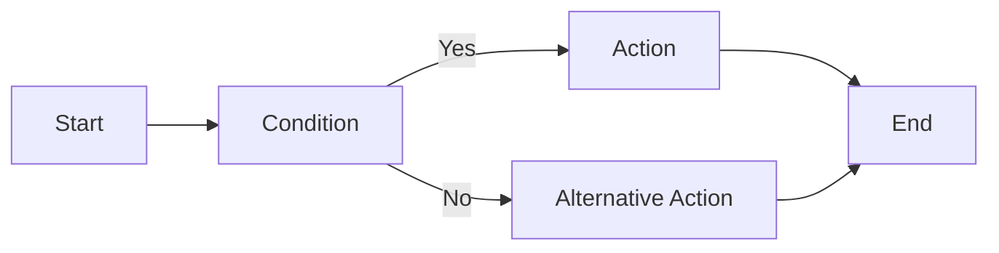
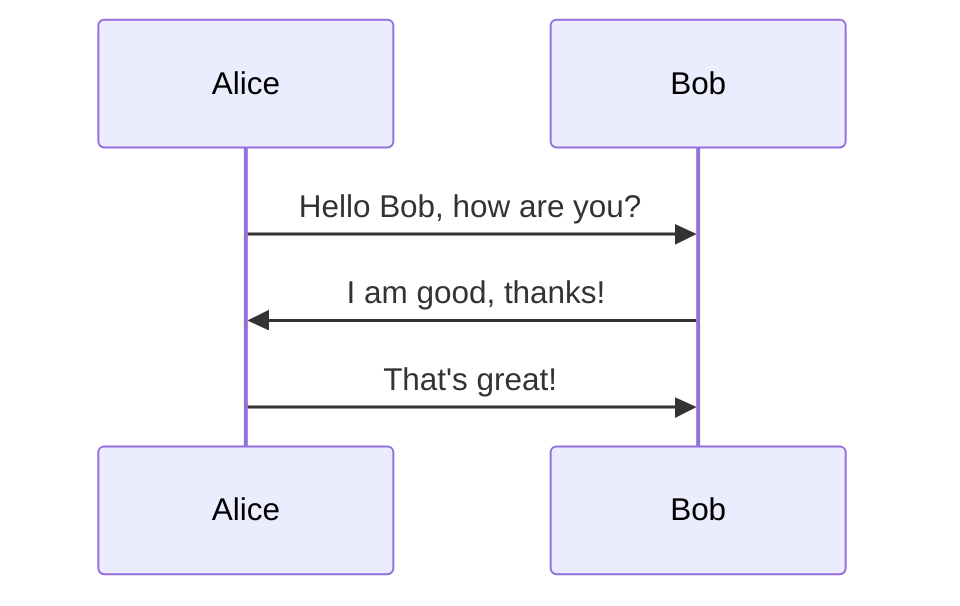
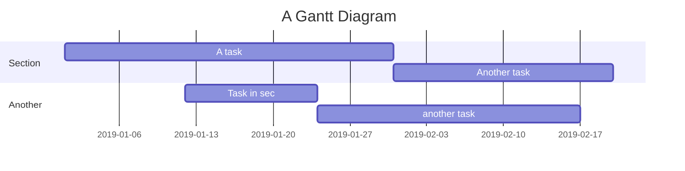

# h1 Heading 8-)

## h2 Heading

### h3 Heading

#### h4 Heading

##### h5 Heading

###### h6 Heading

## Horizontal Rules

one line:

---

and multiple:

---

---

---

## Typographic replacements

Enable typographer option to see result.

(c) (C) (r) (R) (tm) (TM) (p) (P) +-

test.. test... test..... test?..... test!....

!!!!!! ???? ,, -- ---

"Smartypants, double quotes" and 'single quotes'

## Emphasis

**This is bold text**

**This is bold text**

_This is italic text_

_This is italic text_

~~Strikethrough~~

## Blockquotes

> Blockquotes can also be nested...
>
> > ...by using additional greater-than signs right next to each other...
> >
> > > ...or with spaces between arrows.

## Lists

Unordered

- Create a list by starting a line with `+`, `-`, or `*`
- Sub-lists are made by indenting 2 spaces:
  - Marker character change forces new list start:
    - Ac tristique libero volutpat at
    * Facilisis in pretium nisl aliquet
    - Nulla volutpat aliquam velit
- Very easy!

Ordered

1. Lorem ipsum dolor sit amet
2. Consectetur adipiscing elit
3. Integer molestie lorem at massa

4. You can use sequential numbers...
5. ...or keep all the numbers as `1.`

Start numbering with offset:

57. foo
1. bar

## Code

Inline `code`

Indented code

    // Some comments
    line 1 of code
    line 2 of code
    line 3 of code

Block code "fences"

```
Sample text here...
```

Syntax highlighting

```js
var foo = function (bar) {
  return bar++
}

console.log(foo(5))
```

## Tables

| Option | Description                                                               |
| ------ | ------------------------------------------------------------------------- |
| data   | path to data files to supply the data that will be passed into templates. |
| engine | engine to be used for processing templates. Handlebars is the default.    |
| ext    | extension to be used for dest files.                                      |

Right aligned columns

| Option |                                                               Description |
| -----: | ------------------------------------------------------------------------: |
|   data | path to data files to supply the data that will be passed into templates. |
| engine |    engine to be used for processing templates. Handlebars is the default. |
|    ext |                                      extension to be used for dest files. |

## Links

[link text](http://dev.nodeca.com)

[link with title](http://nodeca.github.io/pica/demo/ 'title text!')

Autoconverted link https://github.com/nodeca/pica (enable linkify to see)

## Images


Like links, Images also have a footnote style syntax

![Alt text][id]

With a reference later in the document defining the URL location:

[id]: https://octodex.github.com/images/dojocat.jpg 'The Dojocat'

## Plugins

The killer feature of `markdown-it` is very effective support of
[syntax plugins](https://www.npmjs.org/browse/keyword/markdown-it-plugin).

### [Emojies](https://github.com/markdown-it/markdown-it-emoji)

> Classic markup: :wink: :cry: :laughing: :yum:
>
> Shortcuts (emoticons): :-) :-( 8-) ;)

see [how to change output](https://github.com/markdown-it/markdown-it-emoji#change-output) with twemoji.

### [Subscript](https://github.com/markdown-it/markdown-it-sub) / [Superscript](https://github.com/markdown-it/markdown-it-sup)

- 19^th^
- H~2~O

### [\<ins>](https://github.com/markdown-it/markdown-it-ins)

++Inserted text++

### [\<mark>](https://github.com/markdown-it/markdown-it-mark)

==Marked text==

### [Footnotes](https://github.com/markdown-it/markdown-it-footnote)

Footnote 1 link[^first].

Footnote 2 link[^second].

Inline footnote^[Text of inline footnote] definition.

Duplicated footnote reference[^second].

[^first]: Footnote **can have markup**

    and multiple paragraphs.

[^second]: Footnote text.

### [Definition lists](https://github.com/markdown-it/markdown-it-deflist)

Term 1

: Definition 1
with lazy continuation.

Term 2 with _inline markup_

: Definition 2

        { some code, part of Definition 2 }

    Third paragraph of definition 2.

_Compact style:_

Term 1
~ Definition 1

Term 2
~ Definition 2a
~ Definition 2b

### [Abbreviations](https://github.com/markdown-it/markdown-it-abbr)

This is HTML abbreviation example.

It converts "HTML", but keep intact partial entries like "xxxHTMLyyy" and so on.

\*[HTML]: Hyper Text Markup Language

### [Custom containers](https://github.com/markdown-it/markdown-it-container)

::: warning
_here be dragons_
:::

**MathJax**

I can use MathJax to render mathematical formulas and equations. Here are a few examples:

- Inline formula: $x^2 + y^2 = z^2$

- Block formula:

$$

\frac{x^2 + y^2}{z^2} = 1


$$

- More complex equation:

$$

\begin{align*}

\dot{x} & = \sigma(y-x) \\

\dot{y} & = x(1-z) - y \\

\dot{z} & = xy - bz

\end{align*}


$$

**Mermaid Charts**

I can create a variety of diagrams, including flowcharts, sequence diagrams, Gantt charts, and more. Here are a few examples:

For more documentation, go to this webpage:

- **Flowchart**



- **Sequence Diagram**



- **Gantt Chart**



**Interactive Button Example**

You can also include interactive HTML elements. Here's an example of a button:

<button onclick="alert('Hello! This is a demonstration of a button click.')">Click Me!</button>

When you click the button above, it will display a simple alert message.

**Rendering code**

```python
def calculate_fibonacci(n: int) -> list[int]:
    """
    Calculate Fibonacci sequence up to nth number.

    Args:
        n: Integer number of sequence items
    Returns:
        List of Fibonacci numbers
    """
    result = [0, 1]
    while len(result) < n:
        result.append(result[-1] + result[-2])
    return result

# Example usage with different data types
numbers = calculate_fibonacci(10)
text = "Hello, World!"
flag = True
pi = 3.14159

# Dictionary with mixed types
config = {
    "name": "example",
    "values": [1, 2, 3],
    "enabled": True,
    "ratio": 0.75
}

print(f"Sequence: {numbers}")
```
