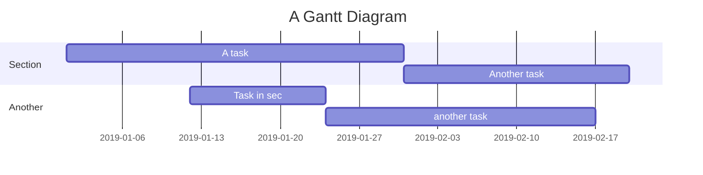

# Some sample text for copying text etc :)

Inline `code`

| Option | Description                                                               |
| ------ | ------------------------------------------------------------------------- |
| data   | path to data files to supply the data that will be passed into templates. |
| engine | engine to be used for processing templates. Handlebars is the default.    |
| ext    | extension to be used for dest files.                                      |

Right aligned columns

| Option |                                                               Description |
| -----: | ------------------------------------------------------------------------: |
|   data | path to data files to supply the data that will be passed into templates. |
| engine |    engine to be used for processing templates. Handlebars is the default. |
|    ext |                                      extension to be used for dest files. |

$$

\begin{align*}

\dot{x} & = \sigma(y-x) \\

\dot{y} & = x(1-z) - y \\

\dot{z} & = xy - bz

\end{align*}


$$



**Rendering code**

```python
def calculate_fibonacci(n: int) -> list[int]:
    """
    Calculate Fibonacci sequence up to nth number.

    Args:
        n: Integer number of sequence items
    Returns:
        List of Fibonacci numbers
    """
    result = [0, 1]
    while len(result) < n:
        result.append(result[-1] + result[-2])
    return result

# Example usage with different data types
numbers = calculate_fibonacci(10)
text = "Hello, World!"
flag = True
pi = 3.14159

# Dictionary with mixed types
config = {
    "name": "example",
    "values": [1, 2, 3],
    "enabled": True,
    "ratio": 0.75
}

print(f"Sequence: {numbers}")
```
