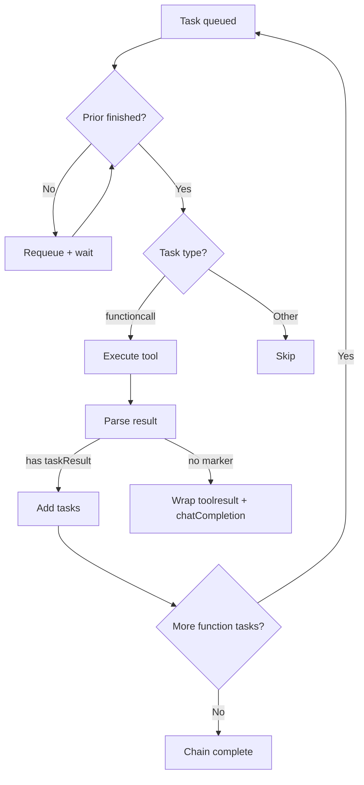

# Taskyon Developer Guide

**Tools, Task Results, and Task Processing**

For a full workflow overview (including entry nodes and tool chooser patterns), see:
`/docs/taskyon_workflow_guide`.

TODO: add the api for our chatCompletion tool...
TODO: add taskyon client description (initialization, config, tools)

---

## 1. Core Concepts

Taskyon uses a **task chain execution model**:

- Tools generate tasks
- Tasks run sequentially or in parallel
- Processing continues until no function tasks remain

Key concepts:

1. **Tools** – callable definitions
2. **makeTaskResult** – return format for new tasks
3. **Task Processing** – high-level API (`processTasks`) that runs and monitors chains

---

## 2. Tools

### 2.1 Definition

A Tool is a callable function, defined by the `ToolBase` schema:

- `name` – must match `/^[a-zA-Z0-9_-]+$/`
- `description` – short LLM-friendly string
- `longDescription?` – optional extended help
- `parameters` – JSON Schema (required)
- `code?` – sandboxed JavaScript implementation
- `function?` – internal function (privileged, full system access)
- `renderOptions?` – UI hints (e.g. `hideChat`, `hideLlm`)

### 2.2 Creation

Use `createTool`:

```ts
export const myTool = createTool({
  name: 'example',
  description: 'Does something useful',
  parameters: {
    /* JSON Schema */
  },
  function: async (params, context) => {
    /* ... */
  },
})
```

### 2.3 Execution Context

Every tool receives a `toolContext`:

- `taskChain` – TaskNode[] for current chain
- `getSecret(name, askNew, saveNew?)` / `setSecret(name, value)`
- `stopSignal` – AbortSignal for cancellation
- `toolId` – unique ID for this tool instance
- `messagePort?` – optional channel for duplex communication

### 2.4 Execution Modes

- **Internal Function** – direct JS call
- **Sandboxed Code** – executed in iframe
- **Remote Function** – forwarded via `postMessage`

---

## 3. makeTaskResult

### 3.1 Purpose

Wraps tasks in a recognized structure so Taskyon continues execution.

### 3.2 Signature

```ts
makeTaskResult(tasks: partialTaskDraft | partialTaskDraft[] | partialTaskDraft[][])
```

Input formats:

- Single task → one `partialTaskDraft`
- 1D array → sequential chain
- 2D array → parallel chains

### 3.3 Usage Patterns

- **Message**

```ts
return makeTaskResult([[{ role: 'assistant', content: { type: 'message', data: 'Hello' } }]])
```

- **Tool result**

```ts
return makeTaskResult([
  [{ role: 'system', content: { type: 'toolresult', data: { result: 'ok' } } }],
])
```

- **Sequential**

```ts
return makeTaskResult([
  [
    { role: 'assistant', content: { type: 'message', data: 'Step 1' } },
    toolCall({ name: 'nextTool', arguments: {} }),
    { role: 'assistant', content: { type: 'message', data: 'Step 3' } },
  ],
])
```

- **Parallel**

```ts
return makeTaskResult([
  [task1, task2],
  [task3, task4],
])
```

- **Re-entry**

If a tool 'sameTool' wants to call itself recursivly it can do this:

```ts
return makeTaskResult([
  [
    { role: 'assistant', content: { type: 'message', data: html } },
    toolCall({ name: 'sameTool', arguments: params }),
  ],
])
```

> If you return a plain value (not wrapped in `makeTaskResult`), Taskyon auto-wraps it in a `toolresult` and adds a `chatCompletion` step.

---

## 4. Task Processing

### 4.1 Overview

Task processing has two parts:

- **High-level API** --- `processTasks`, used by external code
- **Execution Engine** --- ensures correct order, parallelism, and task chain continuation

**Default UI flow:** when a user sends a message, Taskyon appends an **entry node** (usually
`taskyonFlow`) which decides whether to run a plain chat completion, a web search, or an
internal tool-shortlist phase before routing into tool calls. The shortlist phase is only used
when tool chooser is enabled and the available tool count exceeds
`tool_chooser_min_tools`.

### 4.2 processTasks API

`processTasks` is already initialized with a port when used with a client. Use it directly:

```ts
const result = await tyclient.process(taskList, opts)
```

**Parameters**:

- `taskList` – 2D array of parallel task chains
- `opts`:
  - `timeoutMs?` – max wait
  - `signal?` – AbortSignal for cancellation
  - `quitCondition?` – `(t:TaskNode)=>boolean` custom matcher
  - `show?` – whether to display in GUI (default true)

**Execution Flow**:

1. Drafts → full TaskNodes (`forgeTaskChain`)
2. Tasks submitted for execution
3. Subtasks tracked via `taskCreated` events
4. Wait until quitCondition is satisfied
5. Return the matching TaskNode

### 4.3 Usage Examples

- **Wait for message**

```ts
await process(
  [
    [
      { role: 'user', content: { type: 'message', data: 'Hello' } },
      toolCall({ name: 'chatCompletion', arguments: { prompts: ['Respond'] } }),
    ],
  ],
  { timeoutMs: 30000 },
)
```

- **Wait for tool result**

```ts
await process([[toolCall({ name: 'myTool', arguments: { query: 'test' } })]], {
  quitCondition: (t) => t.content.type === 'toolresult' && t.content.data?.status === 'complete',
  timeoutMs: 60000,
})
```

- **Parallel chains**

```ts
await process([[toolCall({ name: 'tool1' })], [toolCall({ name: 'tool2' })]], {
  quitCondition: (t) => t.content.type === 'return',
  show: false,
})
```

---

## 5. How Taskyon Processes Tasks

### 5.1 Flow (simplified)



### 5.2 Rules

- Only `functioncall` tasks are executed
- Each task waits for its `priorID` chain to finish
- A task is complete when all its subtasks have no more function calls
- Tasks with same `parentID` run in parallel; tasks linked with `priorID` run sequentially
- Processing continues until the queue is empty or explicitly stopped
- Errors create `error` tasks, optionally analyzed by a ChatCompletion step

---

## 6. Task Content Types

- `message` – text
- `functioncall` – tool call
- `toolresult` – result of tool execution
- `tooldefinition` – tool registration
- `error` – error info
- `structured` – structured data
- `files` – file references
- `return` – termination marker

---

## 7. Example Tool

```ts
export const exampleTool = createTool({
  name: 'exampleTool',
  description: 'Demonstrates sequential and parallel patterns',
  parameters: {
    type: 'object',
    properties: { query: { type: 'string' }, parallel: { type: 'boolean', default: false } },
    required: ['query'],
  } as const,
  function: async ({ query, parallel }, context) => {
    const secret = await context.getSecret('api-key', true)
    if (context.stopSignal.aborted) throw new Error('Cancelled')

    if (parallel) {
      return makeTaskResult([
        [toolCall({ name: 'tool1', arguments: { q: query } })],
        [toolCall({ name: 'tool2', arguments: { q: query } })],
      ])
    }
    return makeTaskResult([
      [
        { role: 'assistant', content: { type: 'message', data: 'Processing...' } },
        toolCall({ name: 'tool1', arguments: { q: query } }),
        toolCall({ name: 'chatCompletion', arguments: { prompts: ['Analyze result'] } }),
      ],
    ])
  },
})
```

---

## 8. Relationships

- `priorID` – sequential link in chain
- `parentID` – parent-child link for subtasks
- Same `parentID` → parallel execution

---

## 9. Developer Notes

- Returning plain values triggers auto-analysis via ChatCompletion
- Use `makeTaskResult` for fine-grained control of flow
- Errors spawn `error` tasks + optional analysis
- Keep chains concise; execution order guaranteed by `priorID` / `parentID`
