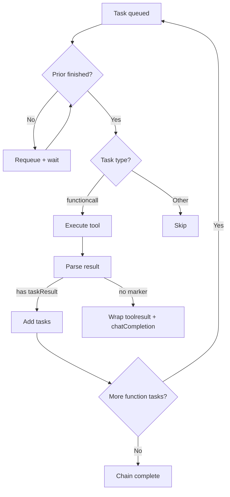

# Taskyon Developer Guide

**Tools, Task Results, and Task Processing**

---

## 1. Core Concepts

Taskyon runs on a **task chain execution model**:

- Tools generate tasks
- Tasks run sequentially or in parallel
- The system continues until no function tasks remain

Three key concepts:

1. **Tools** – definitions of callable functions
2. **makeTaskResult** – standard way to return new tasks
3. **Task Processing** – the worker + external API that execute and monitor tasks

---

## 2. Tools

### 2.1 Definition

A **Tool** is a callable function (from LLM or manually). Defined by `ToolBase` schema:

- `name` – function name (`/^[a-zA-Z0-9_-]+$/`)
- `description` – short LLM-friendly explanation
- `longDescription?` – optional extended help
- `parameters` – JSON Schema (required)
- `code?` – sandboxed JavaScript
- `function?` – privileged internal JS function
- `renderOptions?` – UI hints (e.g., `hideChat`, `hideLlm`)

### 2.2 Creation

Use `createTool` to register:

```ts
export const myTool = createTool({
  name: 'example',
  description: 'Does something',
  parameters: {
    /* JSON Schema */
  },
  function: async (params, context) => {
    /* ... */
  },
})
```

### 2.3 Execution Context

Every tool receives a `toolContext` object:

- `taskChain`: current TaskNode chain
- `getSecret(name, askNew, saveNew?)` / `setSecret(name, value)`
- `stopSignal`: `AbortSignal` for cancellation
- `toolId`: unique per tool instance
- `messagePort?`: optional channel for duplex communication

### 2.4 Execution Modes

1. **Internal Function** – direct JS, full system access
2. **Sandboxed Code** – run inside isolated iframe
3. **Remote Function** – forwarded via `postMessage`

---

## 3. makeTaskResult

### 3.1 Purpose

Wraps new tasks into a `taskResult` object that Taskyon recognizes.

### 3.2 Signature

```ts
makeTaskResult(tasks: partialTaskDraft | partialTaskDraft[] | partialTaskDraft[][])
```

Input formats:

- Single task (`partialTaskDraft`)
- 1D array = sequential chain
- 2D array = multiple parallel chains

### 3.3 Return Value

```ts
{
  taskResultMarker: "*TY_TASKRESULT*",
  taskChainList: partialTaskDraft[][]
}
```

### 3.4 Usage Patterns

- **Simple message**

```ts
return makeTaskResult([[{ role: 'assistant', content: { type: 'message', data: 'Hello' } }]])
```

- **Tool result**

```ts
return makeTaskResult([
  [{ role: 'system', content: { type: 'toolresult', data: { result: 'ok' } } }],
])
```

- **Sequential chain**

```ts
return makeTaskResult([
  [
    { role: 'assistant', content: { type: 'message', data: 'Step 1' } },
    toolCall({ name: 'nextTool', arguments: {} }),
    { role: 'assistant', content: { type: 'message', data: 'Step 3' } },
  ],
])
```

- **Parallel chains**

```ts
return makeTaskResult([
  [task1, task2], // runs sequentially
  [task3, task4], // runs in parallel
])
```

- **Re-entry pattern**

```ts
return makeTaskResult([
  [
    { role: 'assistant', content: { type: 'message', data: html } },
    toolCall({ name: 'sameTool', arguments: params }),
  ],
])
```

> **Note**: If a tool returns a plain value (not `makeTaskResult`), Taskyon auto-wraps it in a `toolresult` + `chatCompletion`.

---

## 4. Task Processing

### 4.1 Two Layers

1. **Internal**: `runTaskWorker` – queue-based execution engine
2. **External**: `processTasks` – higher-level API for submitting + monitoring tasks

### 4.2 processTasks API

```ts
const process = processTasks(tyPort)
const result = await process(taskList, opts)
```

- **`tyPort`** – port for task submission
- **`taskList`** – 2D array of parallel chains
- **`opts`** – options:
  - `timeoutMs?` – max wait
  - `signal?` – abort signal
  - `quitCondition?` – function `(t:TaskNode)=>boolean`
  - `show?` – show in GUI (default true)

**Steps**:

1. Convert drafts → TaskNodes (`forgeTaskChain`)
2. Submit tasks to port
3. Track all subtasks via `taskCreated` events
4. Wait until quitCondition (default: first `message`)
5. Return matching TaskNode

### 4.3 Examples

- Wait for message:

```ts
await process(
  [
    [
      { role: 'user', content: { type: 'message', data: 'Hi' } },
      toolCall({ name: 'chatCompletion' }),
    ],
  ],
  { timeoutMs: 30000 },
)
```

- Wait for tool result:

```ts
await process([[toolCall({ name: 'myTool' })]], {
  quitCondition: (t) => t.content.type === 'toolresult' && t.content.data?.status === 'complete',
})
```

- Parallel chains:

```ts
await process([[toolCall({ name: 'tool1' })], [toolCall({ name: 'tool2' })]], {
  quitCondition: (t) => t.content.type === 'return',
  show: false,
})
```

---

## 5. Internal Task Worker (runTaskWorker)

### 5.1 Flow (simplified)



### 5.2 Rules

- Only `functioncall` tasks are executed
- Tasks wait for `priorID` before running
- Function task is finished when all its child chains have no function tasks
- Parallel = same `parentID`, sequential = linked `priorID`
- Worker runs until queue empty or aborted

### 5.3 Error Handling

Errors produce `error` tasks + optional ChatCompletion analysis.

---

## 6. Task Content Types

- `message` – user/assistant messages
- `functioncall` – tool invocation
- `toolresult` – tool output
- `tooldefinition` – tool registration
- `error` – error info
- `structured` – structured data
- `files` – file refs
- `return` – chain termination

---

## 7. Example Tool

```ts
export const exampleTool = createTool({
  name: 'exampleTool',
  description: 'Demo tool',
  parameters: {
    type: 'object',
    properties: { query: { type: 'string' }, parallel: { type: 'boolean', default: false } },
    required: ['query'],
  } as const,
  function: async ({ query, parallel }, context) => {
    const secret = await context.getSecret('api-key', true)
    if (context.stopSignal.aborted) throw new Error('Cancelled')

    if (parallel) {
      return makeTaskResult([
        [toolCall({ name: 'tool1', arguments: { q: query } })],
        [toolCall({ name: 'tool2', arguments: { q: query } })],
      ])
    }
    return makeTaskResult([
      [
        { role: 'assistant', content: { type: 'message', data: 'Processing...' } },
        toolCall({ name: 'tool1', arguments: { q: query } }),
        toolCall({ name: 'chatCompletion', arguments: { prompts: ['Analyze result'] } }),
      ],
    ])
  },
})
```

---

## 8. Relationships

- `priorID` – sequential link in same chain
- `parentID` – parent/child link for spawned subtasks
- Same `parentID` = parallel execution

---

## 9. Notes for Developers & LLMs

- Plain return values are auto-analyzed via ChatCompletion
- Use `makeTaskResult` for precise control over task flow
- Keep chains small; system enforces ordering via `priorID`/`parentID`
- Errors automatically create analysis subtasks
