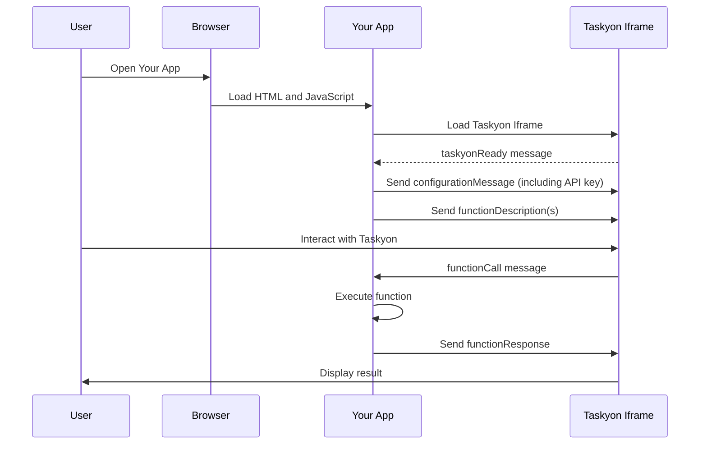

# Taskyon Integration Guide

## Introduction

Taskyon is a versatile AI assistant designed for seamless integration into your webpage or application. This guide will walk you through the process of incorporating Taskyon into your project, explaining key concepts and providing step-by-step instructions.

## Integration Overview

Taskyon utilizes an iframe-based integration method, which offers several advantages:

1. **Security**: The iframe creates a separate sandbox for Taskyon, preventing it from accessing your users' data or manipulating your webpage structure.
2. **Ease of Implementation**: Using an iframe simplifies the integration process, requiring minimal changes to your existing codebase.
3. **Flexibility**: Taskyon can be easily added to various types of web applications and platforms.

### API Key Management and Local-First Approach

Taskyon employs a unique local-first model that eliminates the need for a backend on your side. This approach offers several advantages:

1. **Simplified Integration**: Reduces complexity in your infrastructure.
2. **Cost-Effectiveness**: Minimizes server-side expenses.
3. **Enhanced Data Protection**: Improves compliance with privacy regulations.

However, this model requires a thoughtful approach to API key management. Typically, API keys are kept secure on a server. With Taskyon's local-first model, you'll need to securely share an API key with your users' client-side applications. This is managed in a way that doesn't require users to log in to Taskyon separately from your services, maintaining a seamless user experience.

We provide solutions to handle this securely, which we'll explore in the following sections.

### Useful Hints

- You can make use ofthe "appConfiguration" settings for debugging purpose.
  When taskyon is loaded i an iframe, it displays in a "minimal" mode tailored
  for webpage integration. By setting `guiMode: 'default'` you can prevent this.
  You can also automatically turn on "expert mode" in order to be able to debug prompts.

```javascript
const configuration = {
   llmSettings: {...},
   appConfiguration: {
      expertMode: true,
      guiMode: 'default',
   },
};
```

## Prerequisites

Before you begin the integration process, ensure you have:

- Basic knowledge of HTML and JavaScript
- Access to edit or inject HTML code into your webpage

## Integration Process

### Step 1: Choose an AI Server

Taskyon requires access to an AI server that runs Large Language Models and Multimodal Models. This server must have an OpenAI-compatible API for communication. You have three main options:

Normally, this involves API keys which give you access to this service. As Taskyons _local first_ model doesn't require a backend on your side (which makes it easy to integrate, cheaper and improves data protection compliance) you somehow have to share this API key with your users. As you probably don't want them to login to taskyon in addition to your own services.

1. **Use Taskyon's API Keys With Configuration Enforcement**

   - Visit [https://taskyon.space/account](https://taskyon.space/account) to obtain a rate-limited API key.
   - This option allows you to cap monthly costs and use the keys publicly on your webpage.
   - You can restrict which AI models and configurations your users can access.

2. **Provide Your Own OpenAI-Compatible Backend**

   - Set up your own backend with an LLM model that's compatible with the OpenAI API.
   - You can restrict access to your backend using an API gateway like Kong.

3. **Client-Side Inference** (Currently Limited)
   - While Taskyon supports client-side inference, this option is currently not practical for most end-user devices due to computational limitations.

### Step 2: Configure Taskyon

Taskyon is highly customizable through a JSON configuration file. Key configuration aspects include:

- **API Key**: Configure the API key which taskyon should use.
- **Model Selection**: Choose which AI models your users can access.
- **Custom Functions**: Define specific functions that Taskyon can call within your application.
- ... and many more settings.

For detailed configuration options, visit the [integration page](/integration).

### Step 3: Integrate Taskyon into your app.

Add the Taskyon iframe to your HTML:

```html
<iframe src="https://taskyon.space" id="taskyon-iframe"></iframe>
```

And connect taskyon to your app using minimal provided boilerplate code.

Check the example below for how to do this.

<!--TODO: provide a link to where you can download that bilerplate code from taskyon itself..  prefilled with the correct cofiguration...-->

### Examples and Use Cases

To help you get started, we provide a simple example of Taskyon integration:

- [Simple Example Tutorial](/docs/examples/simpleExampleTutorial): Learn how to integrate Taskyon into a basic webpage.

In the future, we plan to add more complex examples, such as:

- Integration with mapping applications
- WordPress integration
- Split-screen implementations
- Shopify integration

## How does this work?

To better understand the flow of communication between your app and Taskyon, refer to this sequence diagram:



This diagram illustrates the step-by-step process of how your app, the Taskyon iframe, and the user interact during the integration.

## Conclusion

Integrating Taskyon into your webpage or application can significantly enhance its capabilities by providing an intelligent AI assistant. By following this guide, you can seamlessly incorporate Taskyon, ensuring a secure and efficient integration that respects user privacy and enhances functionality.

Remember to regularly check the [Taskyon documentation](https://taskyon.space/docs) for updates, new features, and additional integration options. If you encounter any issues or have questions, don't hesitate to reach out to our support team.

Happy webpage building!
