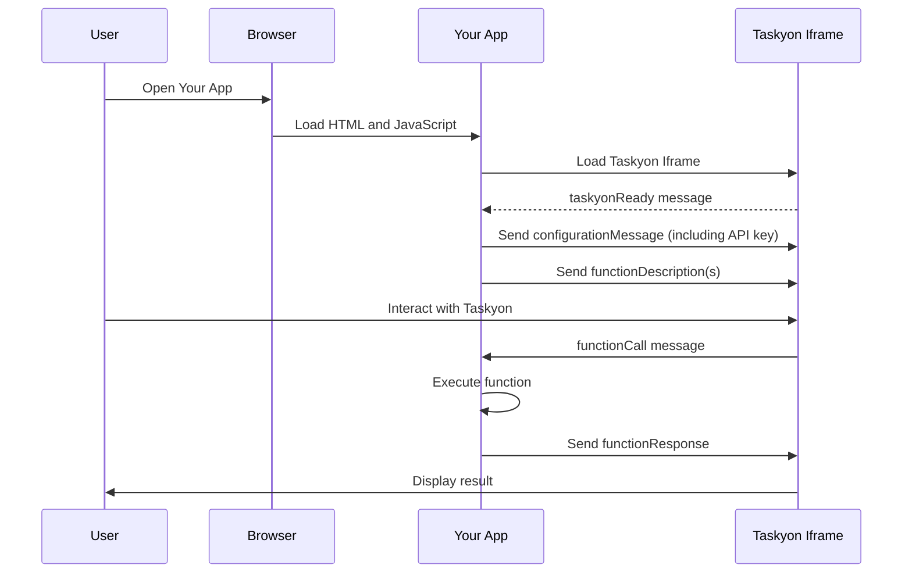

# Taskyon Integration

Taskyon is a powerful AI assistant that can be easily integrated into your webpage or application using an iframe. This guide will provide you with a brief overview of how to get started with Taskyon integration.

Taskyons is built to make integration into other applicatios as easy as possible. This is done by making use of
an [iframe](https://developer.mozilla.org/en-US/docs/Web/HTML/Element/iframe). This is important as this will put taskyon into a separate sandbox from your web application and thus taskyon dosn't have access to any of your/your users data.
This also ensures that taskyon can not manipulate teh structure of your webpage.

## Prerequisites

- Basic knowledge of HTML and JavaScript.
- Some way how to edit/inject html code into your webpage.

## Integration Steps

In order for taskyon to work it needs to have access to an "AI Server" which runs Large Language Models and Multimodal Models. This server needs to have an OpenAI-compatible API in roder for taskyon to communicate with it.

Normally, this involves API keys which give you access to this service. As Taskyons _local first_ model doesn't require a backend on your side (which makes it easy to integrate, cheaper and improves data protection compliance) you somehow have to share this API key with your users. As you probably don't want them to login to taskyon in addition to your own services.

### Create a reate-limited API key with Taskyon

We provide a service to do this on our [webpage](https://taskyon.space/account). Which provides you with a rate-limited API keys to our taskyon API, where you can restrict which configuration (e.g. which AI model) your users are allowed to use. The rate limiting helps you to cap the monthly costs at a specific value and makes it possible to use these keys publicly on your webpage.

In the near future, Taskyon will also have user-individualized API keys in order for you to bill your users based on usage.

### Provide your own OpenAPI based backend

You can use your own backend with an LLM model. As long as it is OpenAI API compatible it should work! You could restrict access to the backend to only your users by combining it with an API gateway such as Kong.

### Client-side inference

While Taskyon is capable of doing client-side inference, this is currently not feasible for most end user
devices such as cell phones or small laptops with limited battery power.

## Configuration

Taskyon can be configured through a JSON configuration file. This allows you to customize various aspects of Taskyon, including:

- **Public API Key**: You can obtain a public API key with rate limiting options from [https://taskyon.space/settings/account](https://taskyon.space/settings/account).

- **Additional Configuration**: You can configure more settings on the [integration](/integration) page.

## Simple Example

- [**Integrate with Your App**](/docs/examples/simpleExampleTutorial): Discover how to integrate Taskyon into your webpage or application using our iframe-based integration.

<!--
## More Examples

- Integration with a mapping application
- TODO: integration into wordpress
- split screen
- integraion into shopify
- ...
-->

## Taskyon integration Sequence Diagram

### Explanation

1. **User Interaction**: The user opens your app in a browser.
2. **App Initialization**: The browser loads the HTML and JavaScript files of your app.
3. **Taskyon Iframe Loading**: Your app loads the Taskyon iframe.
4. **Taskyon Ready**: Taskyon iframe sends a `taskyonReady` message to your app.
5. **Configuration Message**: Your app sends a `configurationMessage` to Taskyon iframe. This is also
   the step where you specify an API key in orde to communicate with an AI Server.
6. **Function Description**: Your app sends a `functionDescription` to Taskyon iframe.
7. **User Interaction with Taskyon**: The user interacts with Taskyon through the iframe.
8. **Function Call**: Taskyon sends a `functionCall` message to your app.
9. **Function Execution**: Your app executes the corresponding function.
10. **Function Response**: Your app sends a `functionResponse` back to Taskyon.
11. **Display Result**: Taskyon displays the result to the user.

## Conclusion

By following these steps, you can easily integrate Taskyon into your webpage or application and allow users to interact with it. Happy webpage building!
