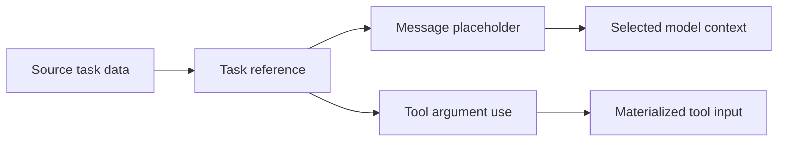

# Chat Output and Task Variables

## Technical output

Taskyon renders ordinary Markdown plus several technical extensions:

- fenced code blocks with syntax highlighting;
- inline equations with `$...$` and block equations with `$$...$$`;
- Mermaid diagrams in `mermaid` code fences;
- tables, footnotes, task lists, and other Markdown extensions;
- supported SVG and HTML blocks in isolated rich-output views.

Generated HTML and scripts should be treated as code. Rendering isolation limits ambient access,
but the content still needs review before it is trusted or connected to host capabilities.

## Files and multimodal input

Files can be attached to a task and stored through the active file service. Taskyon includes
browser paths for text, PDF, Word, image, and other supported content, but actual interpretation
depends on the selected tool and model. Vision and document understanding only work when the
provider/model supports multimodal input and the profile enables it.

## Structured results

A `structured` task stores data as an object rather than presentation text. The UI renders a
compact object view, while later tools can consume the original value. Prefer structured results
when downstream work needs stable fields instead of parsing prose.

## Reusing prior task data

Taskyon assigns presentation names such as `message1`, `python1`, or `result1` to task values in the
current context. A later message can insert a value with a placeholder:

```text
Compare {{result1}} with the constraints in {{message2}}.
```

Placeholders are not expanded inside inline or fenced code. Unknown names fail explicitly instead
of silently inserting the wrong task.

Tool arguments use `$use` so a prior value remains a reference until execution:

```json
{
  "$use": {
    "document": "message1",
    "options.baseline": "result2"
  },
  "question": "List the material differences."
}
```

Each key is a target argument path. It must not conflict with a literal argument at the same path.
At execution time Taskyon loads the referenced task and inserts its `content.data`.



## Portable Markdown task chains

Exported Taskyon Markdown replaces internal task IDs with readable aliases:

```yaml
taskRef: Source_Text
```

References in that exported file use `_tref:Source_Text` or
`{{_tref:Source_Text}}`. Import resolves aliases in order, rejects duplicate or missing aliases,
and creates new local task IDs. `_tref:` is the portable file format; internal stored references
use `_t:` IDs and should not be authored by hand.
