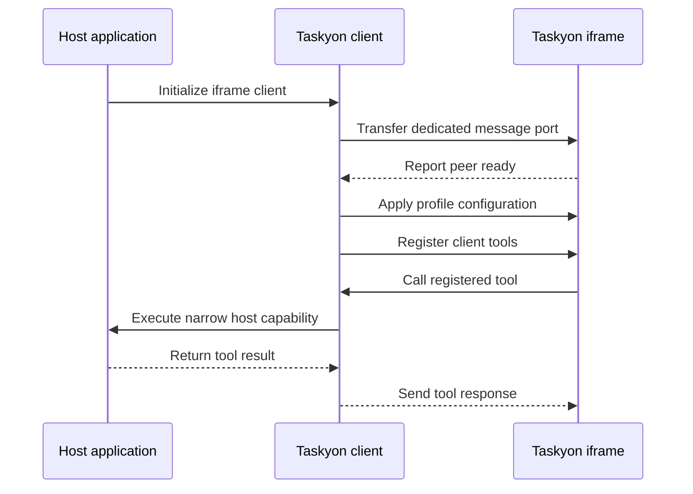

# Embed Taskyon

`@taskyon/tyclient` connects a host webpage to a Taskyon iframe over a typed message-port protocol.
The host controls which client tools are exposed.

```html
<iframe id="taskyon" src="https://taskyon.space"></iframe>
```

```ts
import { createClientTool, initializeTaskyon } from '@taskyon/tyclient'

const client = await initializeTaskyon({
  iframeId: 'taskyon',
  tools: [
    createClientTool({
      name: 'getSelection',
      description: 'Read the selection explicitly exposed by the host application.',
      parameters: { type: 'object', properties: {}, additionalProperties: false } as const,
      function: () => ({ text: 'Selected host data' }),
    }),
  ],
  configuration: {},
})
```

The iframe boundary prevents ambient host-page access. It does not make a broadly privileged client
tool safe: expose narrow operations, validate inputs, and return only the data needed by the task.

The connection sequence is:

1. The host loads the Taskyon iframe.
2. `initializeTaskyon(...)` transfers a dedicated `MessagePort`.
3. The host sends the selected profile configuration and registers its client tools.
4. Taskyon calls only those registered tool contracts.
5. The host returns results over the same typed tool-RPC boundary.



The host does not need a Taskyon-specific backend when it supplies its own model access and tools,
but every external model or service still needs an appropriate credential and security policy.
Never use `postMessage(..., '*')` for an ad hoc integration when the typed client and explicit
target origin are available.

See [Client and Protocol API](../developer/client-api.md) for task execution, files, tool calls, and
readiness handling.
