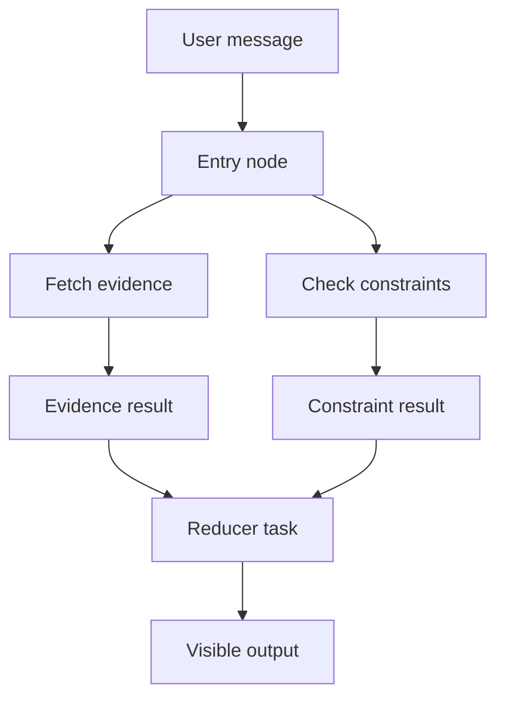

# Task Trees

Taskyon records work as immutable task nodes rather than a flat chat transcript.

- `priorID` links a task to the previous task in the same sequential chain.
- `parentID` links a child chain to the function call that created it.
- Chains sharing a parent can run in parallel.
- `functioncall` nodes request tool execution.
- `toolresult`, `message`, `error`, and `return` nodes make results and completion visible.
- `structured` nodes retain machine-readable data.
- `files` nodes refer to content registered with the active file service.

This structure lets a workflow expose its inputs, evidence, branches, and failures. Long-running
workflows should keep progress in task nodes, explicit arguments, or persisted artifacts rather
than hidden in a running tool process.

Within one chain, `priorID` establishes order. A tool can return several child chains with the same
`parentID`; those sibling chains can proceed independently, while each inner chain remains
sequential. A final `return` marks completion explicitly, but result data should normally live in
the preceding `message`, `structured`, or `toolresult` task.

The model does not automatically receive the entire tree. The active context strategy selects a
projection, such as the current lineage plus visible terminal results from direct child branches.
Render options can also hide internal tasks from chat or model context.

Task nodes include optional author, ACL, and signature fields, but their presence in the schema does
not by itself guarantee that a runtime enforces distributed authorization. Treat P2P verification
and permission evolution as experimental until the relevant protocol and diagnostics enforce it.

Task trees are execution records, not general mutable project storage. Files and durable records
belong behind the storage interfaces described in
[Files, storage, and secrets](storage-and-security.md).
