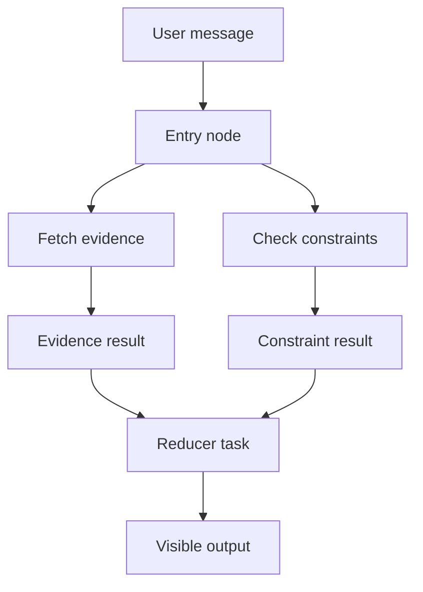

# Task Trees

Taskyon records work as immutable task nodes rather than a flat chat transcript.

Repeated node content is stored once under a content hash. Each occurrence keeps its own links and
references that shared content, so repeated entry-node and chat-completion calls do not require
duplicating the same stored payload.

- `priorID` links a task to the previous task in the same sequential chain.
- `parentID` links a child chain to the function call that created it.
- Chains sharing a parent can run in parallel.
- `functioncall` nodes request tool execution.
- `toolresult`, `message`, `error`, and `return` nodes make results and completion visible.
- `structured` nodes retain machine-readable data.
- `files` nodes refer to content registered with the active file service.

This structure lets a workflow expose its inputs, evidence, branches, and failures. Long-running
workflows should keep progress in task nodes, explicit arguments, or persisted artifacts rather
than hidden in a running tool process.

Within one chain, `priorID` establishes order. A tool can return several child chains with the same
`parentID`; those sibling chains can proceed independently, while each inner chain remains
sequential. A final `return` marks completion explicitly, but result data should normally live in
the preceding `message`, `structured`, or `toolresult` task.

An assistant `message` contains text intended for the conversation. This includes messages from
custom tools, such as a summary or instructions asking you to connect a service. A following
`return` is not needed to make that message visible; `return` controls execution and is hidden
from ordinary chat. Tools should use `structured` or `toolresult` for intermediate data.

Chat renders cached tasks first and loads additional history and result branches in the
background. Visible tool calls have a collapsed, one-line result preview; expand a row to inspect
its arguments and results. Hidden internal tool calls do not gain a visible raw-result row,
although their assistant messages still appear normally. Missing data leaves the available
conversation visible with a Retry action.

**Copy conversation** copies user-facing messages. **Copy everything** and sharing preserve the
selected conversation version and its included tool branches, even when their rows are hidden or
collapsed. Alternative edited questions or regenerated conversation versions are excluded. Files
and other external objects remain references; their bytes are not bundled. Complete-copy and
sharing actions load the required tasks before exporting and report missing data.

```mermaid
flowchart TD
  User[User message] --> Entry[Entry node]
  Entry --> Fetch[Fetch evidence]
  Entry --> Check[Check constraints]
  Fetch --> FetchResult[Evidence result]
  Check --> CheckResult[Constraint result]
  FetchResult --> Reduce[Reducer task]
  CheckResult --> Reduce
  Reduce --> Output[Visible output]
```

The model does not automatically receive the entire tree. The active context strategy selects a
projection, such as the current lineage plus visible terminal results from direct child branches.
For delegated branches, `chatCompletion` receives a bounded handoff containing the objective,
terminal status, and visible result; intermediate tool chains stay out of that handoff. Render
options can also hide internal tasks from chat or model context.
Scoped tool definitions are always omitted from model context and ordinary copied chat; expert
mode may show them only for debugging.

Task nodes include optional author, ACL, and signature fields, but their presence in the schema does
not by itself guarantee that a runtime enforces distributed authorization. Treat P2P verification
and permission evolution as experimental until the relevant protocol and diagnostics enforce it.

Task trees are execution records, not general mutable project storage. Files and durable records
belong behind the storage interfaces described in
[Files, storage, and secrets](storage-and-security.md).
