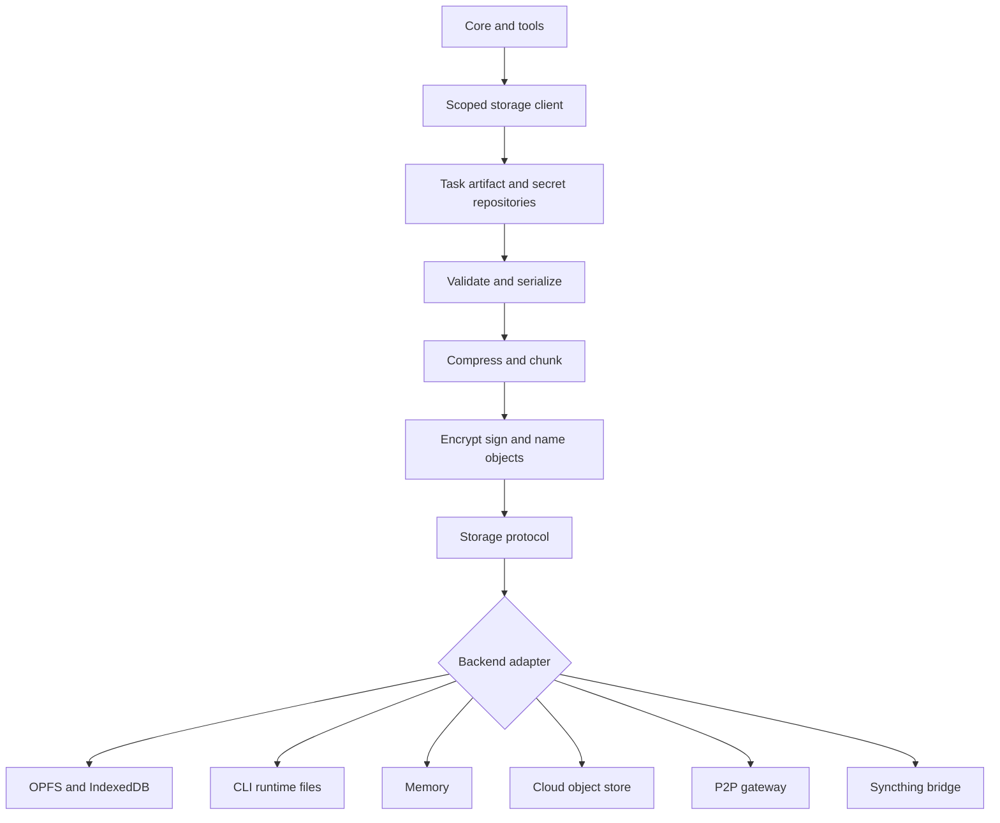
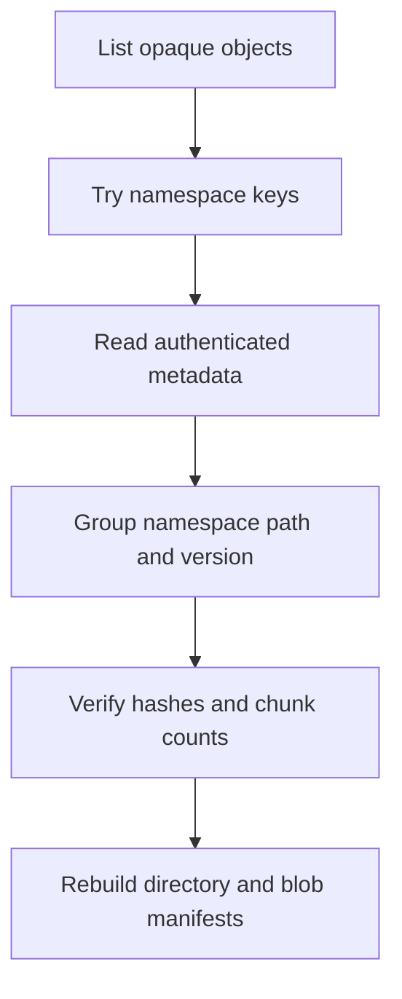

# Taskyon Encrypted Storage Objects Proposal

## Purpose

Taskyon needs a durable storage format that works for browser OPFS, CLI files,
remote object stores, P2P transfer, and untrusted servers. The same model should
serve core data, tool data, artifacts, DAG node results, and encrypted secrets
without forcing everything through PGlite.

This proposal is the concrete object format beneath the broader
`taskyon_runtime_storage_concept.md` and the network service model in
`taskyon_p2p_network.md`.

## Goals

- Multiple Taskyon and `tycli` processes can run at once without sharing one
  persistent PGlite owner.
- Browser and CLI use the same storage semantics, with different local roots.
- Durable data can be stored on untrusted disks, clouds, relays, and peers.
- Tools get scoped storage, not raw access to a global bucket.
- Shared artifact storage exists, but with explicit namespaces and policy.
- Local indexes remain rebuildable caches, not durable authority.
- P2P peers can exchange encrypted records, blob chunks, DAG node results, and
  manifests over the same storage protocol.
- A client with the correct key should be able to recover data by scanning
  available objects, even if manifests are missing or stale.

## Non-Goals

- Do not make P2P the source of truth for normal reads.
- Do not make the fastest peer/backend response win.
- Do not make PGlite the long-term multi-process durable store.
- Do not expose one unrestricted all-purpose storage bucket to every tool.
- Do not require remote backends to understand Taskyon records.

## Storage Layers



The public API should be a `StorageClient`, not raw `CrudWrapper`. `CrudWrapper`
can remain a useful backend/composition helper, but the runtime boundary needs
namespaces, blobs, chunking, encryption policy, manifests, provenance, and
capability checks.

## Namespaces

Namespaces are the main policy boundary.

```text
task/<taskId>
task-archive/<archiveId>
dag/<dagNodeHash>
artifact/<artifactHash>
tool/<toolId>/records/<id>
tool/<toolId>/files/<path>
tool/<toolId>/cache/<id>
workspace/<workspaceId>/records/<id>
conversation/<conversationId>/<id>
secret/<scope>/<name>
index/<indexId>
```

Tools receive scoped storage:

```ts
type ToolStorageContext = {
  records: ScopedRecordStore
  files: ScopedFileStore
  cache: ScopedCacheStore
  secrets: ScopedSecretStore
  blobs: ScopedBlobStore
}
```

Shared storage should be explicit, for example `workspace/*`,
`conversation/*`, or `artifact/*`. A generic all-purpose store can exist only as
a named namespace with permissions, ownership, retention, and sync policy. It
should not be an ambient global bucket.

## Records And Blobs

Use two durable primitives:

- **Records**: structured JSON-like envelopes for tasks, manifests, tool state,
  settings, secret records, workspace metadata, and DAG metadata.
- **Blobs**: binary/text payloads for files, artifacts, large tool results,
  serialized DAG values, and chunk payloads.

Indexes are a third category, but not authoritative:

- vector indexes
- documentation indexes
- task graph indexes
- full-text indexes
- DAG lookup caches

Indexes should usually be local and rebuildable. PGlite is a good fit here.

## Encrypted Object Envelope

Backends store opaque objects. The plaintext envelope is encrypted and
authenticated before it reaches untrusted storage.

```ts
type PlainStorageObject = {
  namespace: string
  objectKind: 'record' | 'blob-manifest' | 'blob-chunk' | 'directory-manifest'
  logicalPath?: string
  versionId: string
  contentType: string
  createdAt: number
  plaintextSize?: number
  chunkPolicy?: ChunkPolicy
  chunkIndex?: number
  chunkCount?: number
  contentHash?: string
  payload: Uint8Array
}
```

The backend object name is not the real path. For deterministic lookup, derive
opaque names with an HMAC over stable logical identifiers:

```text
objectName = HMAC(nameKey, namespace + logicalPath + versionPointer)
```

The encrypted content still stores the real namespace/path/version. This makes
manifests repairable by scanning objects with the correct key.

## Encryption Rules

- Use authenticated encryption such as AES-GCM or XChaCha20-Poly1305.
- Use a unique nonce for every encrypted object/chunk.
- Do not reuse `(key, nonce)` pairs across files or chunks.
- Separate keys by purpose where practical: name HMAC key, content encryption
  key, signing key, and namespace/tool keys.
- Object names can be deterministic HMACs. Nonces must not be deterministic
  unless the selected cipher/mode explicitly supports that safely.
- Remote stores should only see opaque names, encrypted payloads, object sizes,
  and timing.

No salt is required for AES itself. Salt is relevant when deriving keys from
passwords or low-entropy secrets. For stored encrypted objects, the important
thing is a strong key and unique nonce per encryption.

## Chunking

Chunk before encryption. Encrypt each chunk independently.

Reasons:

- hides exact file sizes better when combined with padded size buckets
- limits damage from interrupted uploads/downloads
- enables resumable transfer
- supports P2P reuse and partial transfer
- avoids loading very large blobs into memory
- makes untrusted object stores simpler

Taskyon should use bucketed chunk sizes instead of arbitrary file-size-exact
chunks. The goal is privacy and operational simplicity, not perfect storage
efficiency.

Example bucket policy:

```text
<= 8 KiB      -> one padded 8 KiB chunk
<= 32 KiB     -> 8 KiB chunks
<= 256 KiB    -> 32 KiB chunks
<= 2 MiB      -> 256 KiB chunks
<= 20 MiB     -> 2 MiB chunks
<= 200 MiB    -> 20 MiB chunks
> 200 MiB     -> 20 MiB chunks, unlimited count
```

This keeps small files from creating too many tiny objects, usually limits
normal files to roughly ten chunks or fewer, and still allows very large blobs
to use as many chunks as needed. Exact thresholds should be tuned later with
real data.

Avoid two separate "small file mode" and "large file mode" concepts. The bucket
policy should naturally select the right chunk size.

## Manifests

Manifests are encrypted indexes for speed. They are not the only source of
truth.

Useful manifests:

- root manifest
- namespace manifest
- directory manifest
- latest-version pointer
- blob manifest
- chunk list

Manifests answer common questions quickly:

- what files are in this directory?
- what is the latest version of this path?
- which chunks form this blob?
- what objects should be synced for this namespace?

But every durable object should include enough encrypted authenticated metadata
to repair manifests.

## Recovery

Recovery should work by scanning opaque backend objects:



This only works when the backend can list objects. If a backend cannot list,
Taskyon still needs a known root object, inventory object, or external anchor.

## Lazy Lookup

Fast path:

```text
logical path
  -> deterministic HMAC name for manifest/latest pointer
  -> decrypt manifest
  -> resolve version and chunk refs
  -> fetch chunks by opaque names
  -> decrypt and verify chunks
```

Repair path:

```text
manifest missing/stale
  -> scan opaque objects
  -> decrypt what we can
  -> rebuild manifest
  -> retry fast path
```

This is the practical compromise: manifests are needed for efficient lazy
lookup, but content metadata makes them repairable.

## Versioning

Deterministic path names leak stability: observers can see that the same opaque
object was updated or that a path still exists. To reduce this:

- use immutable version objects
- store latest-version pointers as encrypted manifests
- prefer append/import over in-place overwrite on untrusted stores
- allow compaction later

Fully deterministic version IDs without manifests only work when the reader
already knows the content or can list and scan the backend. For unknown remote
storage, a manifest or root pointer remains necessary.

## P2P Sync

P2P should exchange storage objects, not invent a second storage model.

Peers can request or announce:

- namespace manifests
- encrypted record objects
- blob manifests
- encrypted blob chunks
- DAG node records/blobs
- artifact refs

Normal read flow:

```text
read local store/index
if missing:
  request object/manifest from selected peers or gateways
  verify/decrypt/import locally
  read locally
```

This keeps the local store deterministic while still allowing Taskyon peers to
reuse work from each other.

## Backend Roles

Browser:

```text
durable records/blobs -> OPFS/IndexedDB
indexes               -> PGlite/IndexedDB/memory
secrets               -> encrypted records
```

CLI:

```text
durable records/blobs -> files under ~/.local/share/tycli or configured root
config                -> ~/.config/tycli
cache/indexes         -> ~/.cache/tycli or memory-backed PGlite
secrets               -> encrypted records
```

Untrusted cloud/P2P:

```text
records -> encrypted envelopes
blobs   -> encrypted chunk objects
indexes -> local by default, syncable only as an optimization
```

## Migration Path

1. Define storage object refs, envelopes, and namespace policy types.
2. Add a local file/object backend for CLI durable records and blobs.
3. Move CLI PGlite to memory or cache-only for indexes.
4. Add OPFS object backend for browser.
5. Add protocol-backed storage client over FRP/ports.
6. Give tools scoped storage in their execution context.
7. Move task records and artifacts behind repository helpers over storage.
8. Store DAG nodes/results as records/blobs and keep indexes rebuildable.
9. Add chunked encrypted blobs.
10. Add manifest repair by scanning local objects.
11. Add P2P/cloud gateways that sync encrypted objects and manifests.

## Summary

Taskyon durable storage should be encrypted object storage with namespaces,
records, blobs, bucketed chunking, repairable manifests, deterministic HMAC
lookup names, and local rebuildable indexes.

PGlite remains useful for indexes and vector search. `CrudWrapper` remains an
implementation helper. The durable authority becomes scoped storage objects
served through Taskyon storage services and moved across local, browser, cloud,
and P2P boundaries by the same protocol.
