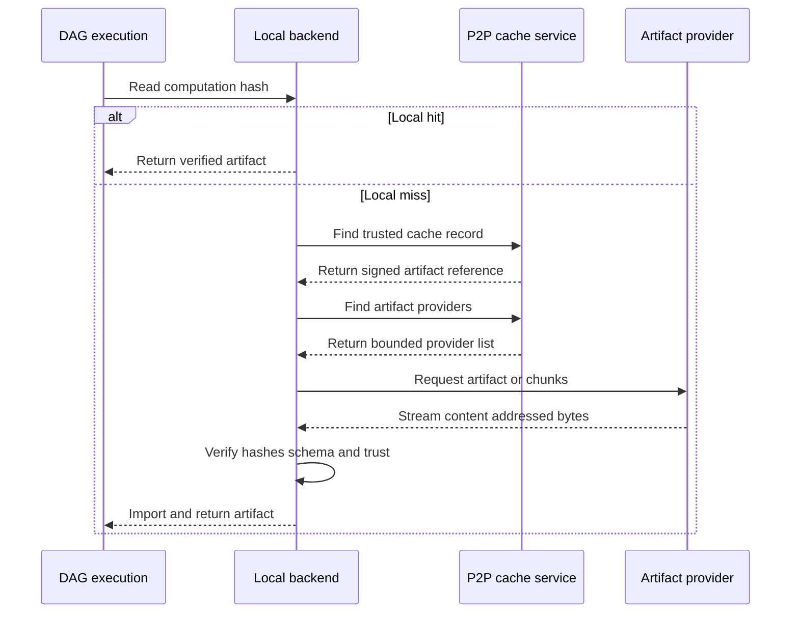
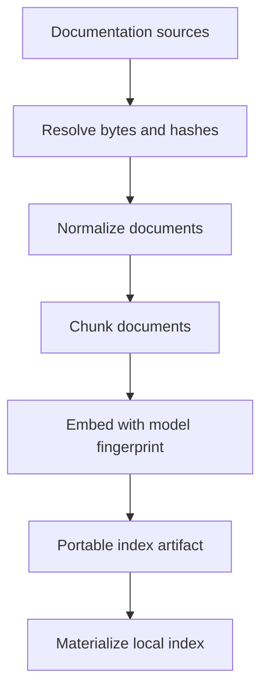

# Taskyon P2P DAG Cache Proposal

## Summary

Taskyon should allow peers in a subnetwork to reuse deterministic `dagCore`
results through a content-addressed P2P cache.

The P2P cache is a remote `DagStorageBackend` capability behind a local-first
backend:

```text
dagCore
  -> local-first DagStorageBackend
       -> memory / OPFS / files
       -> P2P DAG cache
            -> ordinary cache peers
            -> pinned storage peers
            -> object-store gateways
```

Normal execution reads locally first. On a local miss, the P2P backend resolves
a computation hash to a trusted cache record, downloads the referenced
content-addressed artifact from any available provider, verifies it, imports it
locally, and returns it through the existing DAG storage boundary.

This proposal specializes the service model in `p2p-network.md`, the runtime
boundary in `runtime-storage.md`, and the object format in
`encrypted-storage.md`. It does not introduce a second Taskyon storage model.

## Current State

`dagCore` already separates:

- cache entries that map a computation key to an artifact hash;
- artifacts addressed by their result hash;
- execution from the selected `DagStorageBackend`;
- local in-memory and OPFS backend implementations.

Taskyon P2P already provides libp2p connectivity, subnetwork discovery, relays,
topics, and direct protocol streams.

The missing pieces are:

- cryptographically sound canonical DAG hashes;
- complete computation identity, including upstream artifacts and execution
  dependencies;
- a layered local/remote DAG backend;
- signed cache records;
- artifact-provider discovery;
- verified artifact and chunk transfer;
- replication, pinning, expiry, and garbage collection.

The current pseudo-hash in `packages/comp-dag/caching.ts` must not be used as a
remote cache identity.

## Goals

- Reuse deterministic DAG results across browser, CLI, workers, and storage
  peers.
- Keep memory, OPFS, files, databases, and object stores interchangeable behind
  the DAG storage interface.
- Let any peer provide bytes for a known artifact hash.
- Support large artifacts through verified chunks fetched from several peers.
- Keep the local cache authoritative for normal reads and execution continuity.
- Allow gateways to make an S3-compatible object store or database appear as a
  P2P cache peer.
- Make remote reads and publication explicit policy choices.
- Preserve enough provenance to audit where a reused result came from.

## Non-Goals

- Do not use the first unverified cache response.
- Do not treat subnetwork membership alone as proof that a result is correct.
- Do not make transient P2P shards the only durable copy of an artifact.
- Do not publish private computation inputs or outputs by default.
- Do not share results from nondeterministic or environment-dependent nodes
  without an explicit identity for those dependencies.
- Do not couple `dagCore` to libp2p APIs.
- Do not execute code received from the artifact cache.

## Identity Model

The cache has two identities:

```text
computation hash -> cache record -> artifact hash
```

The computation hash identifies what was evaluated. The artifact hash
identifies the exact output bytes.

### Artifact Identity

Artifacts must use canonical bytes and real SHA-256:

```ts
type ArtifactRef = {
  hash: `sha256:${string}`
  mediaType: string
  byteLength: number
  encoding: 'identity' | 'gzip' | 'zstd'
  manifestHash?: `sha256:${string}`
}
```

The hash is computed over the canonical uncompressed artifact bytes. Compression
and transport chunking are storage concerns and must not change logical
artifact identity.

Every received artifact is decoded, hashed, and validated against the node's
output schema before it is admitted to the local cache.

### Computation Identity

A remotely cacheable computation must have one canonical identity:

```text
SHA-256(
  cache-key-format version
  node content hash
  normalized parameter hash
  ordered upstream artifact hashes
  static dependency fingerprint
  declared execution-environment fingerprint
)
```

Large inputs are represented by immutable artifact references. Their content
hashes participate in the computation identity; their complete bytes do not
need to be embedded in the key.

Mutable locations such as URLs and OPFS paths are not identities. The runtime
must resolve their bytes and content hashes before a dependent computation can
use the shared cache.

Nodes without a content hash, nodes using undeclared ambient state, and nodes
whose outputs are intentionally nondeterministic default to local-only or
`NoCache`.

## Cache Records

A cache record is a claim that a computation produced an artifact:

```ts
type DagCacheRecordV1 = {
  format: 'taskyon.dag-cache-record.v1'
  computationHash: `sha256:${string}`
  artifact: ArtifactRef
  nodeHash: `sha256:${string}`
  producerPeerId: string
  producedAt: number
  expiresAt?: number
  signature: string
}
```

The producer signs the canonical record without the `signature` field.

An artifact hash proves byte integrity. It does not prove that the artifact is
the correct result for a computation. A client therefore accepts a cache record
only through its configured trust policy.

Initial trust modes:

```ts
type DagRemoteCacheTrust =
  | { mode: 'disabled' }
  | { mode: 'trustedProducers'; producerKeys: string[] }
  | { mode: 'trustedSubnetwork' }
  | { mode: 'confirmations'; minimum: number }
```

The recommended first implementation is `trustedProducers`. A controlled
subnetwork may opt into `trustedSubnetwork`. Confirmation mode is useful later,
but several peers repeating one poisoned record are not equivalent to
independent recomputation.

If accepted cache records for one computation point to different artifact
hashes, the client must not choose the fastest response. It reports a conflict,
quarantines those records, and computes locally unless policy selects one
trusted producer explicitly.

## Provider Announcements

Cache records and artifact availability are separate announcements.

A peer that can serve an artifact advertises:

```ts
type DagArtifactProviderV1 = {
  format: 'taskyon.dag-artifact-provider.v1'
  artifactHash: `sha256:${string}`
  peerId: string
  byteLength: number
  manifestHash?: `sha256:${string}`
  availability: 'transient' | 'replicated' | 'pinned'
  expiresAt: number
  signature: string
}
```

Provider announcements expire unless renewed. Expiry prevents disconnected
peers from remaining permanent routing candidates.

The network should not broadcast every artifact hash continuously. An initial
implementation can query connected subnetwork peers with a bounded deadline.
Larger networks can add DHT provider records, compact inventories, or gateway
indexes without changing the artifact protocol.

## Artifact Manifests And Sharding

Small artifacts can transfer as one verified object. Larger artifacts use a
content-addressed manifest:

```ts
type DagArtifactManifestV1 = {
  format: 'taskyon.dag-artifact-manifest.v1'
  artifact: ArtifactRef
  chunking: {
    algorithm: 'fixed'
    chunkSize: number
  }
  chunks: Array<{
    index: number
    hash: `sha256:${string}`
    byteLength: number
  }>
}
```

The manifest itself is content-addressed. A downloader can request different
chunks from different peers, verify each chunk immediately, reassemble the
canonical artifact bytes, and verify the final artifact hash.

Sharding improves transfer and storage distribution, but it does not imply
durability. Cache policy must distinguish:

- **transient**: held by an ordinary peer and eligible for local eviction;
- **replicated**: retained while the subnetwork maintains a target replica
  count;
- **pinned**: retained by a designated storage peer or gateway until explicitly
  released.

A replication controller can assign missing chunks to capable storage peers.
Object-store gateways can pin complete artifact manifests and chunks while
exposing the same P2P service contract.

## Protocol Shape

The cache should use a dedicated service-scoped protocol with local command
names. The transport adapter maps it to a libp2p protocol such as:

```text
/taskyon/dag-cache/1.0.0
```

Initial request/response operations:

```text
cache.findRecords(computationHash)
cache.publishRecord(record)
artifacts.findProviders(artifactHash)
artifacts.getManifest(manifestHash)
artifacts.getChunk(chunkHash)
artifacts.announce(provider)
artifacts.pin(artifactHash, policy)
```

Commands return bounded results. Chunk responses are streamed and have strict
size limits. Cancellation and timeouts apply to discovery and every transfer.

The service is implemented over Taskyon FRP/port protocols and adapted to
libp2p streams. `dagCore` sees only `DagStorageBackend`; it must not import P2P
types.

## Local-First Backend

The execution engine continues to receive one `DagStorageBackend`. A layered
backend owns the actual policy:



```text
read cache entry
  -> local cache record
  -> accepted remote cache records

read artifact
  -> local artifact
  -> remote providers
  -> verify
  -> import locally

write artifact
  -> write locally
  -> optionally announce or publish

write cache entry
  -> write locally
  -> optionally sign and publish
```

Remote failure is a cache miss, not an execution failure, unless a caller
explicitly selected read-only remote execution. Offline nodes continue using
their local backend.

Recommended policy:

```ts
type DagRemoteCachePolicy = {
  reads: 'off' | 'trusted'
  writes: 'off' | 'public' | 'subnetwork'
  trust: DagRemoteCacheTrust
  timeoutMs: number
  maxArtifactBytes: number
  replication?: { targetCopies: number; ttlMs: number }
}
```

Remote writes default to `off`. Public or subnetwork publication requires a
node-level data classification that permits it.

## Security And Privacy

### Integrity

- Use real SHA-256 for computation keys, artifacts, manifests, and chunks.
- Verify signatures before accepting cache records or provider announcements.
- Verify each chunk and final artifact before local import.
- Validate cached values against the owning node's output schema.
- Reject oversized, malformed, expired, or replayed protocol objects.

### Correctness

- Only deterministic nodes with complete dependency identity use shared cache.
- Cache records from untrusted producers are hints, not accepted results.
- Conflicting trusted records fail closed and trigger local computation.
- Worker identity and artifact provenance remain inspectable.

### Confidentiality

Content addressing does not make data private. Artifact hashes and lookup
requests reveal equality and access patterns.

- Private nodes default to local-only.
- Remote publication requires explicit `public` or subnetwork visibility.
- Subnetwork-private artifacts use the encrypted object format from
  `encrypted-storage.md`.
- Encryption uses randomized nonces, so the ciphertext object has its own
  transport hash. An authenticated encrypted manifest binds the logical
  plaintext artifact hash to the encrypted chunks.
- Secret namespaces and raw provider credentials are never DAG cache content.

### Resource Abuse

- Limit query fan-out, response count, artifact size, chunk size, and concurrent
  transfers.
- Rate-limit peers and temporarily block repeated invalid responses.
- Do not allocate storage merely because an untrusted peer announces an
  artifact.
- Require policy approval before accepting replication or pin requests.

## Replication And Garbage Collection

Every stored artifact records its local reason:

```text
active computation dependency
recent cache hit
transient downloaded cache
replica assignment
explicit pin
object-store gateway pin
```

Garbage collection may evict transient artifacts using size and recency limits.
It must preserve active dependencies, explicit pins, and current replication
assignments.

Provider announcements are renewed only while the peer can still serve the
complete artifact or advertised chunks. A peer removes or lets its announcement
expire before deleting the final local copy.

The replication controller should prefer peers across different failure
domains when that information is available. Replica count is a durability
target, not a guarantee.

## Documentation Index Example

Documentation indexing can become one consumer of the general cache:



Unchanged document hashes reuse cached chunks and embeddings. Changed documents
produce new computation hashes. PGlite remains a local query index and is
rebuilt or updated from portable DAG artifacts.

The P2P layer does not need a documentation-specific cache protocol.

## Failure Behavior

- **No peers or timeout**: continue with local computation.
- **Cache record missing**: compute locally.
- **Provider disappears**: try another provider, then compute locally.
- **Invalid chunk or artifact**: discard it, penalize the provider, and try
  another provider.
- **Invalid cache signature**: ignore and report the record.
- **Conflicting trusted cache records**: quarantine and compute locally.
- **Schema-invalid artifact**: reject even when its hash is valid.
- **Insufficient disk space**: stream when supported or compute without
  retaining the remote artifact.
- **Remote publication failure**: preserve the local result and report a
  non-fatal cache warning.

## Implementation Stages

### Stage 1: Trustworthy Local Identity

1. Replace the pseudo-hash with canonical serialization and real SHA-256.
2. Give remotely cacheable nodes immutable content identity.
3. Include upstream artifact and dependency fingerprints in computation keys.
4. Validate artifacts and cached outputs on every backend read.
5. Add diagnostics for collisions, stale node versions, changed inputs, and
   schema-invalid cached values.

### Stage 2: General Remote Cache Boundary

1. Add a layered local-first `DagStorageBackend`.
2. Define canonical cache records, artifact refs, and signatures.
3. Implement a deterministic in-process remote backend test double.
4. Add remote read-through, local import, opt-in write-through, timeouts, and
   conflict handling.
5. Keep the backend transport-neutral.

### Stage 3: Trusted P2P Cache

1. Define the service-scoped cache and artifact protocol.
2. Add bounded connected-peer discovery for cache records and providers.
3. Transfer whole small artifacts over direct libp2p streams.
4. Verify signatures, hashes, sizes, and output schemas.
5. Add browser/Node diagnostics using the existing local relay harness.

### Stage 4: Sharding And Durability

1. Add artifact manifests and verified chunk transfer.
2. Fetch chunks concurrently from several providers.
3. Add expiring provider announcements.
4. Add replication assignments, pins, and garbage collection.
5. Add object-store and database gateway peers.

### Stage 5: Private And Wider-Network Caching

1. Add encrypted subnetwork artifact manifests and chunks.
2. Add data-classification policy for node results.
3. Add scalable provider lookup beyond connected-peer queries.
4. Add quota, accounting, abuse controls, and operational metrics.

## Diagnostics And Acceptance Criteria

The design is ready for general use when diagnostics prove:

- identical node identity, parameters, dependencies, and environment produce
  the same computation hash in browser and Node;
- changing any identity input causes a cache miss;
- a local miss can retrieve a signed cache record and verified artifact from a
  peer;
- the retrieved artifact is imported locally and remains usable after the peer
  disconnects;
- corrupt chunks, wrong artifact hashes, bad signatures, expired
  announcements, and schema-invalid values are rejected;
- conflicting cache records do not use first-response-wins behavior;
- remote timeout and full peer loss fall back to local computation;
- large artifacts can be assembled from chunks supplied by several peers;
- replication and pin policies survive ordinary peer churn;
- private nodes never announce or publish without explicit policy;
- browser and Node exercise the same protocol semantics through their runtime
  adapters.

## Decision Summary

- `DagStorageBackend` remains the `dagCore` storage boundary.
- The P2P cache is a remote backend behind a local-first layered backend.
- Cache records and content-addressed artifact delivery are separate.
- Cache records require signatures and trust policy.
- Any peer may serve an artifact after its expected hash is known.
- P2P artifacts use the shared encrypted storage-object model where
  confidentiality is required.
- Sharding uses verified chunk manifests; replication and pinning provide
  durability.
- Remote publication is opt-in and private DAG results stay local by default.
- Documentation indexing is an example DAG workflow, not a special P2P cache.
