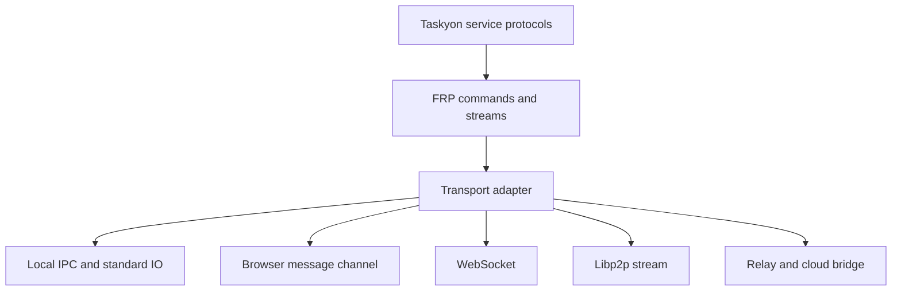
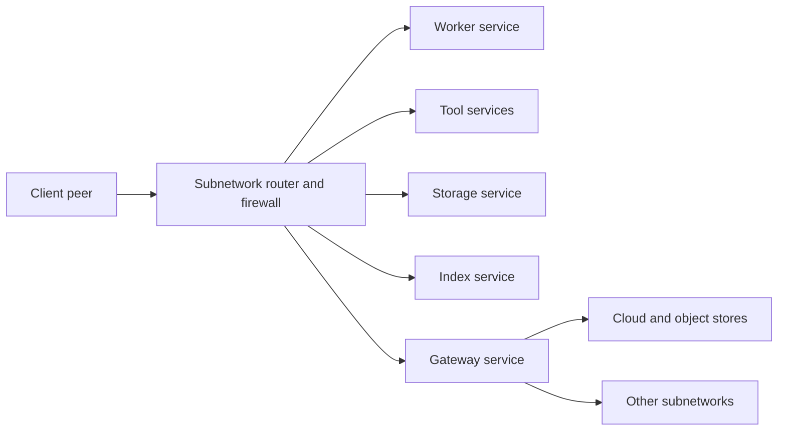

# Taskyon P2P Network Concept

## Core Model

A Taskyon subnetwork is a logical entity: a shared organization, workspace,
team, project, or personal network. It can be thought of as a collective
Taskyon runtime. People, agents, tools, storage services, UIs, CLIs, workers,
and gateways join the subnetwork as peers and contribute capabilities.

This is the technical basis for the "hivemind" idea: an organization can make
its task trees, stored knowledge, DAG computations, tools, and agents available
through one shared network entity. A human joining from a browser or CLI becomes
part of that entity by using and contributing services through Taskyon
protocols.

The key terms are:

- **Subnetwork/entity**: the shared logical Taskyon network with membership and
  policy.
- **Peer**: one runtime endpoint inside one or more subnetworks.
- **Service**: a capability announced by a peer, such as storage, UI, worker,
  tool host, indexer, or gateway.
- **Router**: selects which service receives a protocol request.
- **Firewall**: filters protocol traffic by scope, trust, capability, and
  transport.
- **Gateway**: bridges subnetworks, local transports, P2P, cloud, or external
  systems.

Taskyon should use one protocol family over streams:



The protocol should be consistent whether peers run on the same machine or
across the world. The transport can change, but Taskyon should avoid separate
local-only APIs when the same FRP protocol can express the behavior.

Storage services in this network should exchange the encrypted storage object
format described in `encrypted-storage.md`. The P2P layer
should route and replicate those objects; it should not create a separate
storage model.

The specialized design for sharing deterministic computation results,
content-addressed artifacts, and sharded cache chunks is in
`p2p-dag-cache.md`.

## Why libp2p

Taskyon currently builds its P2P runtime on libp2p. The selection fits the
requirements that survived the earlier candidate review:

- multiple transports and encrypted, authenticated streams;
- peer discovery and relay support without making one relay the data owner;
- pub/sub and direct protocol streams in one extensible stack;
- browser and Node implementations;
- protocol identifiers that let Taskyon add service-specific streams.

Earlier research also considered WebRTC-only meshes, Hyperswarm, IPFS/PubSub,
Nostr-style relays, Matrix, Gun, Secure Scuttlebutt, and custom WebSocket
networks. Each can solve part of the problem, but using one as Taskyon's base
would either narrow runtime support, couple storage to networking, depend more
heavily on centralized servers, or require Taskyon to rebuild discovery,
identity, routing, and stream negotiation. Those comparisons were a
time-specific research snapshot, not a permanent claim that libp2p is best for
every application.

The decision should be revisited if browser interoperability, relay cost,
metadata privacy, or maintenance evidence changes materially. Taskyon's FRP
protocols must therefore remain independent of libp2p stream implementation
details.

## Service Announcements

When a peer joins a subnetwork, it should mainly announce the services it
provides.

Examples:

```text
storage service       stores records/blobs in OPFS, files, encrypted DB, cloud,
                      Syncthing bridge, or another backend
worker service        executes tools, tasks, or sandboxed workflows
tool host             exposes specific tools over tool execution streams
individual tool       exposes one tool as its own service, for example bash,
                      CLI command execution, documentation search, modelica
                      compilation, or artifact conversion
UI service            browser UI, CLI, mobile UI, dashboard, or embedded
                      Taskyon view driven through taskyonProtocol streams
client service        lightweight interactive client with cache-only local state
index service         vector search, documentation index, full-text index
gateway service       bridges another subnetwork, cloud backend, relay, or
                      external system
```

Announcements should be signed and should expire unless renewed. They should
describe:

```text
service id
service type
supported protocols
namespaces/scopes
trust requirements
visibility
availability/durability
transport endpoints
limits/capacity
```

The network should not assume that every peer stores everything or can execute
everything. A lightweight client may have only a cache and use a storage service
announced by the subnetwork. A transient worker may execute tasks and push
results back, then disappear.

Individual tools can be separate services. This is useful for dangerous,
expensive, host-specific, or sandboxed capabilities. For example, a peer could
announce a `bash` tool service, a CLI execution service, or a compiler service
without also acting as a general worker. Routers and firewalls must treat those
tool services as privileged endpoints: public P2P traffic should not get raw
tool execution unless policy explicitly allows it.

UI surfaces should also be first-class services. A browser UI, CLI, dashboard,
or embedded Taskyon view can announce that it provides a human-facing interface
for selected scopes. The UI should communicate with the rest of the subnetwork
through `taskyonProtocol` and related FRP streams, not through a separate
UI-only integration path.



## Storage In The Network

Storage is a service capability, not a machine-local assumption.

An entity can have one, many, or no storage services at a given moment:

```text
organization subnetwork
  disk storage service       durable files on a workstation/server
  browser OPFS service       browser-local storage
  encrypted cloud service    untrusted encrypted object storage
  Syncthing bridge           replicated folder backend
  cache-only client          small local cache, no durable authority
```

Clients and workers access storage through a storage protocol over FRP streams.
The backend is hidden behind the storage service. This lets a lightweight
Taskyon client start quickly, discover available storage, and operate without
owning durable storage locally.

The unit of durable exchange is an encrypted storage object:

```text
encrypted record envelope
encrypted blob manifest
encrypted blob chunk
directory/namespace/latest-version manifest
DAG node record/blob
artifact ref
```

Objects are encrypted before they reach untrusted peers or remote stores. Local
indexes such as vectors, documentation search, and full-text indexes are
normally rebuilt locally from imported records/blobs. They can be synced later
as an optimization, but they should not be authoritative.

For correctness, storage routing should be deterministic:

```text
namespace -> selected durable storage service
namespace -> optional cache services
namespace -> optional mirrors/archive services
```

Avoid "whoever answers first" reads. Multiple storage services are useful, but
they need explicit roles such as primary, mirror, cache, archive, read-only
import, or untrusted encrypted blob sink.

Normal network read flow should be:

```text
read local store/index
if missing:
  request manifest/object from selected storage peers or gateways
  verify, decrypt, and import locally
  read through the local storage/index path
```

This keeps peer reuse compatible with local-first behavior and makes DAG node
results reusable across the subnetwork without turning remote peers into an
implicit database.

## Abstract Requirements for the P2P Network

1. **Subnetwork Membership**
   - Subnetworks are defined by a shared secret/password.
   - Only peers with the secret can join/communicate.
   - Peers can join **multiple subnetworks** simultaneously.
   - Joining requires a **proof of legitimacy** to prevent spam or fake requests.

2. **Peer Discovery**
   - Peers must be able to discover others in the same subnetwork.
   - Discovery should work without centralized servers (but allow optional bootstrap helpers).
   - Metadata leakage (e.g., observable who is in which subnet) should be minimized.

3. **Messaging**
   - Within a subnetwork, peers need broadcast (pub/sub) and optionally direct messaging.
   - All messages must be authenticated/encrypted with keys derived from the shared secret.

4. **Connectivity & Resilience**
   - The network should handle peers joining/leaving frequently.
   - Messages and peer lists should propagate efficiently without overwhelming the network.

5. **Scalability**
   - Support small subnetworks (a few peers) and larger groups (hundreds+).
   - Messaging should avoid naïve full-mesh flooding.

6. **Privacy & Security**
   - Subnetwork secrets should not be exposed via discovery mechanisms.
   - Replay protection and forward secrecy are desirable.

7. **Extensibility**
   - Higher-level protocols (file sharing, state sync, etc.) can be built on top.
   - The network layer should remain **transport-agnostic**, able to swap underlying implementations.

## Routing And Safety

Taskyon protocol messages should not automatically cross every boundary. The
router/firewall layer decides which commands and streams are allowed.

Examples:

```text
local UI -> local/core task protocol               allowed
worker -> storage namespace assigned to task       allowed
remote peer -> secret namespace                    blocked by default
public P2P -> raw tool execution                   blocked by default
gateway -> encrypted blob import/export           allowed by policy
remote peer -> encrypted artifact/DAG object       allowed by namespace policy
```

This keeps the subnetwork model powerful without turning every peer into an
unrestricted remote-control surface.

## Shared Task-Tree Trust

The optional identity and signature fields on a `TaskNode` do not currently
enforce authorization. A future protocol for exchanging shared task trees could
build that enforcement from:

- immutable, content-addressed task nodes;
- creator signatures verified before a node is accepted;
- a root or namespace authority that defines who may append;
- signed permission changes recorded as append-only policy nodes;
- effective permissions resolved from the validated task lineage.

A peer should reject nodes that fail integrity, signature, or effective-policy
checks. Parallel permission changes also need an explicit deterministic conflict
rule; timestamps alone are not a sufficient authorization policy. This is a
design direction, not a description of current enforcement.

## Future Information-Sharing Policy

Automatic sharing of task results, artifacts, indexes, or compute capacity is
not implemented merely because peers can connect. Any future policy must make
the following explicit:

- which namespace and content type may be advertised;
- whether data is public, subnetwork-scoped, capability-scoped, or private;
- who may request it and how authorization is proven;
- retention, revocation, freshness, and provenance;
- resource limits and defenses against spam, poisoning, replay, and free
  riding;
- what a user can inspect, disable, or delete.

Possible incentives include quotas, reciprocal contribution, organization
budgets, reputation, credits, or payment. None should be embedded in the
transport layer. A useful exchange policy must remain optional, auditable, and
separate from peer discovery and message delivery. This section preserves
research requirements; it does not describe current product behavior.

## Design Direction

Taskyon should be network-native but not transport-monoculture.

The goal is:

```text
one subnetwork/entity model
one service announcement model
one FRP protocol family
many stream transports
many service backends
```

This lets local multi-process Taskyon, browser/CLI pairs, remote workers,
storage services, and P2P peers use the same mental model. A peer is a protocol
endpoint with identity and capabilities, not necessarily a machine.
