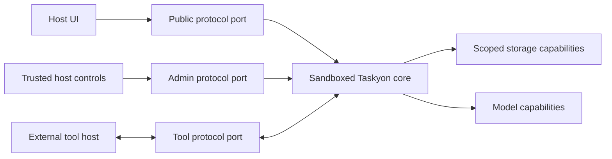

# Taskyon Sandboxed Core And Protocol Design

## Summary

Taskyon should become a protocol-first agent runtime. The UI should not call normal core methods
directly. Taskyon core should be controlled through typed protocol ports, and that same protocol
boundary should work when core later runs inside a sandboxed iframe in the browser or a separate
process in Node/CLI.

The first implementation phase is not the sandbox service. The first phase is completing the
`taskyonProtocol` boundary inside the current in-process Taskyon app.

## Why This Split Matters

Taskyon is an agent, not a passive chat widget. The host application must be able to restrict what
the agent can see and do.

A direct Vue/package integration gives nice UX but weakens the security model if Taskyon core can
reach host internals. A full iframe app gives isolation, but it drags in too much Taskyon product UI.
The target architecture is therefore:

- host owns the UI and product experience
- Taskyon core owns agent execution and task state
- protocol ports are the only boundary between them
- host capabilities are explicit and auditable



## Target Runtime Layers

### Taskyon Core

Owns:

- task manager and task graph state
- task worker and execution queue
- tool definitions and tool execution orchestration
- LLM orchestration
- file/task backup logic
- secret access through explicit capability providers
- streams for task updates, worker status, and tool calls

### Taskyon Protocol

Owns the public contract between core and any UI or host:

- task commands
- task streams
- tool registration and execution
- file commands
- metadata commands
- backup/import commands
- selected read/search commands

### Host UI

Owns:

- chat presentation
- settings screens
- routing
- layout and dockview integration
- theme and product shell
- file picker UX
- host-specific tool registration

The Taskyon app itself should use this same host/UI role. Pinia stores should become protocol
clients rather than privileged direct callers into core internals.

## Public Versus Admin Capabilities

Do not add a generic `adminMode: true` flag. Privilege should be structural.

### Public Client

Can:

- create tasks
- create task chains
- read allowed tasks and task chains
- receive task updates
- register host tools
- receive tool calls and return tool results
- upload files through allowed file commands

### Admin Client

Can additionally:

- patch profile/settings
- switch active profile
- set or rotate binding/session keys
- manage provider API keys
- manage secrets
- delete all tasks
- reset or rebuild vector indexes
- inspect diagnostics/admin logs
- manage storage namespaces

Admin access should be a separate protocol extension or separate port. A third-party service client
that only receives the public port must not be able to call admin operations.

### Tool Client

Can:

- receive specific tool execution requests
- send tool responses or cancellations

Tool clients must not automatically receive task-manager, secret-store, or admin capabilities.

## Sandbox Direction

Later, Taskyon core should run as a long-lived sandbox service.

Reuse the existing sandbox infrastructure:

- browser: `srcdoc` iframe with `sandbox="allow-scripts"` and no `allow-same-origin`
- Node/CLI: separate child process

Do not use the current one-shot `executeInWorkerSandbox(...)` API unchanged for core runtime. It is
excellent for isolated short jobs, but Taskyon core needs a long-lived service with protocol ports,
streams, lifecycle, cancellation, and capability handlers.

The future service shape should look conceptually like:

```ts
createTaskyonCoreSandbox(options): Promise<{
  publicPort: Port
  adminPort?: Port
  stop(reason?: string): void
}>
```

## Storage And Secrets

Storage bridges must be capability-based, not generic filesystem APIs.

Good capabilities:

- profile storage
- task storage
- file/blob storage
- cache storage
- secret storage

Each namespace should be explicit, quota-aware, and schema-validated where possible. Secrets should
not be exposed to ordinary public clients.

## Migration Strategy

1. Move direct `tyCore()` return-object methods into `taskyonProtocol` one by one.
2. Keep public operations and admin operations separate.
3. Make Taskyon app stores use protocol clients.
4. Shrink the direct `Taskyon` return object until it contains only lifecycle and port internals.
5. Add admin protocol/port only after public protocol migration is underway.
6. Build the long-lived sandbox service after the app can already operate through protocol.

This order avoids mixing two hard changes: protocol completion and sandbox runtime creation.

## Current Migration Status

The in-process protocol boundary now exposes service-scoped `peer`, `task`, `tools`, `files`, and
`archive` operations, plus P2P services. The FRP protocol helper composes service names into flat
wire commands while `createPortClient` exposes a nested client such as `client.task.get(...)`.

Some direct `tyCore()` methods and privileged host setup paths still exist. Their presence is
migration debt, not permission to expose them through a generic public RPC object. For each
operation:

1. identify whether the public client, host/admin client, or tool client owns it;
2. add the command or stream to that service-scoped protocol;
3. migrate the real caller and shared browser/Node diagnostics;
4. remove the corresponding direct proxy method when no caller needs it.

The maintained implementation owners are:

- `packages/taskyon/src/api/taskyonProtocol.ts`;
- `packages/taskyon/src/api/storageProtocol.ts`;
- `packages/taskyon/src/api/taskyonClient.ts`;
- `packages/taskyon/src/core/toolRpc.ts`.

The earlier migration checklist named older source paths and a fixed method inventory. Those
details are intentionally not retained because the protocol surface now evolves at its owning
modules.

## Non-Goals For The First Phase

- Do not build the sandbox service yet.
- Do not create a new UI package yet.
- Do not embed the full Taskyon app in Joulios.
- Do not move Taskyon settings UI into Joulios.
- Do not expose all core methods over a generic RPC bridge.

## Acceptance Criteria

- Migrated UI operations use `taskyonProtocol` clients.
- Migrated methods are removed from `createProxyApi(...)`.
- Public protocol does not contain destructive/admin-only operations.
- Admin operations are clearly separated when introduced.
- Browser and Node diagnostics continue to exercise the same behavior.
- No type weakening or compatibility wrappers are introduced.
