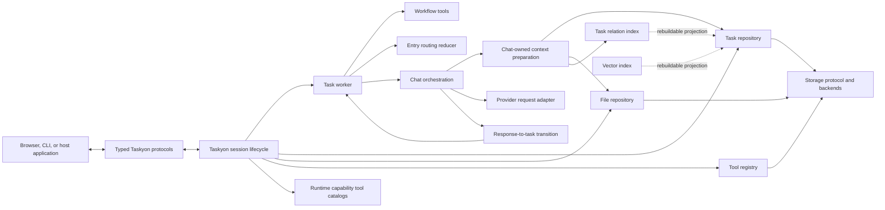

# Taskyon Core Refactor Design Proposal

## Status

Proposed.

This document describes an incremental refactor of `packages/taskyon`. It does not propose a
rewrite, a new UI, or immediate behavior changes.

The proposal is based on a source audit of the `dev` branch on 2026-07-17. At that point,
`packages/taskyon` contained approximately 30,000 lines of TypeScript and JavaScript. The largest
concentrations were:

- `tools/chatCompletionTool.ts`: 2,033 lines
- `tools/entryNode.ts`: 1,256 lines
- `core/taskManager.ts`: 1,131 lines
- `tools/webResearchTool.ts`: 988 lines
- `utils/crudWrapper.ts`: 784 lines
- `core/taskWorker.ts`: 747 lines
- `api/index.ts`: 654 lines
- `core/init.ts`: 633 lines

File size is not itself the problem. The concern is that these files combine responsibilities with
different owners, change rates, runtime requirements, and verification strategies.

## Summary

Taskyon should keep its current task-tree execution model while making the boundaries between task
state, workflow routing, LLM integration, runtime lifecycle, storage, tools, and public protocols
explicit.

The intended direction is:

- keep workflow state visible in task data and task trees;
- make `entryNode` an explicit routing reducer rather than a collection of repeated task builders;
- separate chat context rendering, provider requests, and response-to-task transitions;
- split `TyTaskManager` into task, relation, file, tool, vector, and import/export services;
- give each Taskyon session one lifecycle owner;
- preserve the simplified worker scheduler while fixing task-tree completion invalidation;
- use `StorageRecordBackend` and the storage protocol as the durable storage boundary;
- compose tools from explicit runtime capabilities;
- narrow package entrypoints and protocol surfaces;
- migrate provider-specific and legacy task types only after the new boundaries are established.

The first implementation slice should be behavior-preserving extraction around chat context
rendering and response-to-task transitions. It should not begin with a new package, a TaskNode schema
migration, or a broad directory move.

## Relationship To Existing Proposals

This proposal complements:

- [Sandboxed Core Protocol](sandboxed-core-protocol.md), which defines the protocol-first core and
  host boundary;
- [Runtime Storage](runtime-storage.md), which defines `StorageClient` and storage services as the
  durable runtime boundary;
- [Encrypted Storage](encrypted-storage.md), which defines encrypted durable object storage.

Those documents remain authoritative for sandboxing, public/admin protocol separation, and durable
storage. This proposal focuses on reorganizing the current core so those designs can be implemented
without carrying the existing ownership problems forward.

## Goals

1. Make the execution flow understandable from task input to persisted result.
2. Keep workflow semantics inspectable in the task tree.
3. Make browser and Node runtime capabilities explicit.
4. Let core services depend on narrow functions or domain services instead of whole managers.
5. Establish one source of truth for task, storage, tool, and provider contracts.
6. Make session startup, replacement, cancellation, and disposal auditable.
7. Allow focused diagnostics to verify each refactor stage.
8. Remove dead or ambiguous tool implementations instead of preserving them through wrappers.

## Non-Goals

- Replacing Taskyon's task-tree model.
- Building the future sandbox service in the first phase.
- Moving Taskyon UI ownership out of the Taskyon application.
- Rewriting the storage backends.
- Publishing `@taskyon/taskyon` as a standalone package immediately.
- Creating a generic dependency-injection framework.
- Introducing repository, service, factory, or adapter layers that only rename another function.
- Moving tool schemas away from their `createTool` declarations.
- Changing prompts, tool behavior, provider behavior, or task serialization as part of mechanical
  extraction.
- Migrating the `TaskNode` schema before its consumers have narrow boundaries.

## Design Principles

### Preserve Explicit Task Workflows

Task chains and branches should remain visible where a workflow tool returns
`createSubtasksResult(...)`. Refactors must not hide task order or branching behind generic workflow
builders.

`taskPlanner` and other workflow tools own workflow semantics. `entryNode` owns routing and
continuation mechanics. `chatCompletion` owns model interaction. The worker owns task execution and
settlement.

### Keep Context Projection Tool-Owned

Taskyon core supplies neutral task storage and traversal capabilities. Each tool owns how it selects,
folds, and interprets that task tree for its reducer. Core must not import concrete tool
implementations or impose an LLM-specific context policy.

For chat completion, context selection and reference resolution happen inside the self-contained
`chatCompletion` tool before its provider request. Extracted context functions receive only the
explicit task and file capabilities they use, never a whole `TyTaskManager`. Shared tool utilities
should be promoted only after multiple tools demonstrate the same semantics.

### Keep Tool Declarations Whole

Each public tool should retain one readable `createTool({ ... })` declaration containing its name,
description, parameter schema, render options, and top-level execution flow.

Meaningful domain logic may be extracted. Schemas and execution bodies should not be scattered into
one-line wrappers or disconnected constants merely to shorten a file.

### Prefer Domain Services Over Generic Frameworks

The proposal uses names such as task repository, relation index, and tool registry to describe
ownership. These should be plain typed functions or objects with explicit dependencies, not a class
hierarchy or service container.

### Separate Durable State From Rebuildable Projections

Task records, files, and metadata are durable state. Relation maps, vector indexes, tool indexes, and
completion caches are projections that must be rebuildable and invalidated by source events.

## Current Ownership Problems

### Chat Completion

`chatCompletionTool.ts` currently contains:

- task-chain and context selection;
- task-to-model message rendering;
- file and multimodal conversion;
- Taskyon variable presentation and materialization;
- provider-specific request options;
- Taskyon service-token delegation;
- streaming, timeout, and partial-result handling;
- YAML and tagged-tool-call parsing;
- tool-call conversion;
- response-to-task transitions;
- metadata and tracing.

These operations do not change for the same reasons and should not share one implementation unit.

### Task Management

`taskManager.ts` currently owns:

- task, metadata, and file storage construction;
- in-memory relation maps;
- task creation and immutable persistence;
- chain and tree traversal;
- file upload and lookup;
- vector indexing and search;
- tool definition indexing;
- task deletion;
- JSON, YAML, and Markdown import/export.

The current return object makes all of these capabilities appear to have one owner.

### Entry Routing

`entryNode.ts` separately handles:

- prompt template normalization;
- prompt interpolation;
- mode detection;
- error retry detection;
- tool catalog lookup;
- shortlist parsing;
- DIY tool-call parsing;
- provider-native tool routing;
- web-search routing;
- repeated construction of chat-completion and re-entry tasks.

Several branches produce the same task shapes with slightly different options. This makes it easy
for tracing, multimodal, prompt, or tool-choice behavior to drift between paths.

### Runtime Lifecycle

`core/init.ts` creates and connects:

- databases and task storage;
- crypto sessions;
- secret storage;
- task manager instances;
- session tools;
- task workers;
- tool RPC executors and brokers;
- public protocol servers;
- iframe message bridges;
- task and worker streams;
- proxy APIs;
- session replacement and disposal.

The mutable session context is necessary, but its lifecycle is spread across construction, proxy
creation, and session switching.

### Storage Utilities

`crudWrapper.ts` combines:

- the generic CRUD contract;
- immutable, locking, live-stream, and combined decorators;
- PGlite SQL storage;
- vector storage and model invocation;
- encryption;
- interactive secret storage.

Its `upsert` contract explicitly permits storage implementations to behave differently. This is a
correctness problem before it is an organizational problem.

### Tool Registration

The default catalog currently includes development and testing tools alongside normal tools. Some
runtime choices are made during module evaluation, while other tool files are never registered.

Examples of ambiguous or unregistered modules include `ragTool.ts`, `gdrive.ts`,
`seleniumTool.ts`, and `webBrowsing.ts`. `ragTool.ts` overlaps `localVectorStore.ts`, uses a
hard-coded database name, and advertises branches it does not implement.

## Target Architecture



The arrows represent direct dependencies, not new wrapper layers. The public host communicates
through typed protocols. Internal orchestration uses explicit dependencies and task data.

## Proposed Boundaries

### 1. Chat Context Rendering

Keep task projection and model-context preparation inside the self-contained `chatCompletion` tool.
The context boundary receives the selected tasks plus only the neutral capabilities needed to
resolve referenced tasks and files:

```ts
type PrepareChatCompletionContextInput = {
  taskChain: TaskNode[]
  getTaskById: TaskGetter
  getFileMapping: (id: string) => Promise<FileMapping | null>
  getUploadedFile: (id: string) => Promise<File | undefined>
  toolDefinitions: Record<string, ToolBase>
  allowedTools: string[]
  appendSystemPrompts: string[]
  prependSystemPrompts: PromptInjection[]
  useVisionModels: boolean
}
```

The important constraints are:

- `chatCompletion` chooses and requests its task projection;
- context preparation does not receive `TyTaskManager`;
- presentation-variable state is created per invocation and shared only with that invocation's
  response interpretation;
- rendering is deterministic for the same tasks and dependencies;
- Taskyon variable names remain presentation-only;
- durable `_t:` task references are preserved at persistence boundaries.

The owned boundary is:

```ts
const prepareChatCompletionContext = async (
  input: PrepareChatCompletionContextInput,
): Promise<{
  messages: ModelMessage[]
  tools: ToolSet
  variableService: TaskVariablePresentationService
}>
```

`convertTaskNodesToOpenAIChat` remains the stable public rendering function and is directly
re-exported from the tool module.

### 2. Provider Request Construction

Provider differences should be handled by one explicit strategy switch. Avoid a provider class
hierarchy unless providers demonstrate reusable lifecycle behavior.

```ts
const buildProviderRequest = (input: {
  provider: apiConfig
  model: string
  messages: ModelMessage[]
  tools: ToolSet
  schema?: Record<string, unknown>
  options: ChatRequestOptions
}): StreamTextOptions => {
  switch (input.provider.name) {
    case 'openai':
    case 'chatgpt-codex':
    case 'anthropic':
    case 'openrouter':
    // Provider-owned normalization.
  }
}
```

Taskyon token delegation is authentication for one provider and should be resolved before generic
request construction.

### 3. Response-To-Task Transition

Move assistant-output sanitation, native tool-call conversion, structured response handling, and
termination-task creation into one pure transition boundary.

```ts
type AssistantTransition =
  | { type: 'tool-calls'; tasks: partialTaskDraft[]; sanitation: AssistantOutputSanitation[] }
  | { type: 'answer'; tasks: partialTaskDraft[]; sanitation: AssistantOutputSanitation[] }
  | { type: 'structured'; tasks: partialTaskDraft[]; sanitation: AssistantOutputSanitation[] }
```

This boundary should not query task storage. It receives the normalized provider result, available
tools, and variable presentation service.

### 4. Entry Routing Reducer

Normalize the current entry state into one decision:

```ts
type EntryNodeDecision =
  | { mode: 'answer'; allowedTools: string[] }
  | { mode: 'shortlist'; catalog: Array<{ name: string; description: string }> }
  | { mode: 'select-tool'; allowedTools: string[] }
  | { mode: 'call-tool'; call: FunctionCall }
  | { mode: 'recover'; allowedTools: string[]; retryCount: number }
```

The `entryNode` tool declaration should still show the returned task arrays. A reducer may remove
duplicated option calculation, but it must not hide the workflow shape.

Prompt template defaults remain owned by `src/assets/taskyon_settings.json`. The reducer consumes
resolved settings; it does not introduce new hard-coded defaults.

### 5. Task Services

Split the current manager by source-of-truth ownership:

```text
TaskRepository
  durable task and metadata operations

TaskRelationIndex
  prior, sibling, parent, child, and leaf projections

FileRepository
  mappings and file/blob access

ToolRegistry
  default and persisted tool definitions

TaskVectorIndex
  rebuildable embeddings and similarity search

TaskImportExport
  Markdown, YAML, and JSON conversion using repository functions
```

A small composed Taskyon-facing object may remain for compatibility during migration, but new core
code should consume the owning service directly. Do not add default factories that merely capture a
database or rename another constructor.

### 6. Task Completion Projection

Keep the worker's current `readyQueue`, `pendingByPrior`, and active task separation unless a failing
diagnostic proves they should change.

Replace the positive-only completion assumption with a projection driven by task relationship
events:

```text
task created/deleted
  -> update relation index
  -> invalidate affected completion entries
  -> reevaluate waiting parent/prior tasks
```

The projection may cache completion, but cache validity must follow task-tree changes. P2P imports
and editable trees must not leave a previously finished parent permanently cached as finished.

Error metadata propagation should use an explicit persistence or stream event instead of polling
five times with a fixed delay.

### 7. Session Lifecycle

Create one resource-owning session boundary:

```ts
type TaskyonSession = {
  port: Port
  queueTask: (id: string) => void
  stop: (reason: string) => void
  dispose: (reason: string) => void
}
```

The concrete session may expose internal services to `tyCore`, but public consumers should use
protocol clients. `dispose` must own every stream subscription, port filter, broker, executor, and
message adapter created by the session.

`tyCore` should be responsible only for:

- static port creation;
- creating the current session;
- replacing a session when crypto identity changes;
- exposing lifecycle and protocol ports.

This follows the protocol-first design and allows the future sandbox service to host the same
session boundary.

### 8. Storage Modules

Reuse the existing `StorageRecordBackend`, `StorageRecordCrud`, and storage protocol rather than
creating a competing abstraction.

Separate the current utility file into owned modules:

```text
storage/recordCrud.ts
storage/mapRecordBackend.ts
storage/pgliteRecordBackend.ts
storage/recordStreams.ts
storage/vectorIndex.ts
storage/encryptedRecordBackend.ts
storage/secretStore.ts
```

Names are illustrative. The split should follow actual imports and ownership.

Before moving code, define and test the semantics of:

- missing records;
- set versus add;
- replacement;
- shallow and deep merge;
- atomicity;
- clear notifications;
- combined memory/durable stores.

If merge behavior cannot be identical across backends, remove it from the base interface and make
the owning higher-level service perform the merge explicitly.

### 9. Public Entrypoints

The desired entrypoints are conceptual capabilities, not broad utility barrels:

```text
@taskyon/taskyon
  stable task and tool contracts

@taskyon/taskyon/api
  protocol clients and task-running API

@taskyon/taskyon/browser
  browser-only authentication and runtime helpers

@taskyon/taskyon/tycli
  Node-compatible runtime entrypoint

@taskyon/taskyon/tools
  explicit default tool setup
```

Internal crypto, PGlite, object helpers, P2P implementations, and provider adapters should not be
re-exported from the root merely because the application currently imports them there.

Do not create a separate API package until:

1. the public client no longer imports core implementation modules;
2. its dependency list is clear;
3. browser and Node consumers can use the same contract without implementation leakage.

### 10. Runtime Tool Catalogs

Tool availability should be assembled from explicit capabilities:

```ts
type TaskyonRuntimeCapabilities = {
  browser: boolean
  node: boolean
  tauri: boolean
  development: boolean
  testing: boolean
}
```

The concrete type may use injected functions instead of booleans where a capability has behavior.
The important point is that selection happens during setup, not through module-level environment
capture.

Suggested catalogs:

- core tools;
- browser tools;
- Node/CLI tools;
- Tauri tools;
- development tools;
- diagnostic/testing tools.

Every tool module must be either:

- registered in an explicit catalog and covered by a diagnostic;
- exported as an intentional optional tool;
- marked as an experiment outside the production tool tree;
- deleted.

`ragTool.ts` should not be generalized. Decide whether its intended behavior belongs in
`localVectorStore`, implement and register it with injected storage, or delete it.

### 11. Web Research Modules

Keep the four public tool declarations explicit, but move their unrelated implementation concerns
to owned modules:

```text
webResearchWorkflow.ts
browserMcpAccess.ts
proxyWebReader.ts
webResearchTools.ts
```

The browser MCP transport should be shared with other MCP consumers instead of being owned by the
research workflow. HTML onboarding belongs to the browser-access interaction boundary. Proxy
authentication and HTTP request construction belong to the proxy reader.

### 12. Task And Provider Types

This is a later migration.

The target separation is:

```text
TaskNode and TaskContent
  durable workflow representation

TaskExecutionMeta
  runtime status, diagnostics, costs, and traces

TaskMessageContent
  Taskyon message semantics

Provider messages and responses
  private to provider/LLM adapters
```

OpenAI-compatible types should not define the durable Taskyon model. The `role` field, ACL/signature
fields, task state, and provider annotations need separate decisions and should not be changed
together.

## Migration Plan

### Phase 0: Characterization And Boundaries

1. Add focused diagnostics for current chat rendering and response transitions.
2. Capture native tool call, structured response, text answer, partial stream, file, and task
   variable cases.
3. Add dependency-boundary checks where practical.
4. Record current public imports before narrowing exports.

No production behavior changes in this phase.

### Phase 1: Chat And Entry Routing

1. Extract chat-owned context preparation with invocation-scoped presentation state.
2. Extract deterministic task-to-model rendering.
3. Extract provider request construction.
4. Extract response-to-task transitions.
5. Normalize entry routing decisions.
6. Remove repeated entry-node option and task construction while keeping branch shapes visible.

Completion criteria:

- existing chat and entry diagnostics pass;
- tool schemas and settings remain unchanged;
- `chatCompletion` no longer needs a whole task manager after context has been built;
- response transition tests do not require a database.

### Phase 2: Task And Storage Services

1. Define storage operation semantics with backend contract tests.
2. Move vector and secret behavior out of the generic CRUD module.
3. Extract the relation index from `TyTaskManager`.
4. Extract file and tool registries.
5. Move Markdown, YAML, and JSON import/export to functions accepting repository operations.
6. Keep a temporary composed manager only for unmigrated callers.

Completion criteria:

- task storage works through both PGlite and protocol-backed storage;
- relation indexes can be rebuilt from tasks;
- imports do not require the full manager;
- no parallel storage abstraction is introduced.

### Phase 3: Worker And Session Lifecycle

1. Drive completion invalidation from task relation events.
2. Replace error metadata polling with an explicit event.
3. Create the resource-owning session boundary.
4. Move direct `tyCore` methods behind existing protocols where public.
5. Keep admin/destructive capabilities separate.

Completion criteria:

- worker diagnostics cover late child creation and invalidation;
- session replacement disposes all prior resources exactly once;
- public clients do not receive manager or secret-store internals;
- browser and CLI use the same worker and protocol behavior.

### Phase 4: Tool And API Cleanup

1. Introduce capability-based tool catalogs.
2. Remove or complete unregistered tools.
3. Split web research implementation concerns.
4. Narrow package exports and direct dependencies.
5. Migrate application imports to intentional entrypoints.

Completion criteria:

- testing and development tools are opt-in;
- unavailable capabilities are absent rather than fake no-ops;
- no production tool captures runtime selection at module load;
- root exports contain stable Taskyon contracts, not implementation utilities.

### Phase 5: Domain Type Migration

1. Inventory every persisted `TaskNode` and `TaskNodeMeta` field.
2. Separate provider message types from durable Taskyon types.
3. Replace remaining `any` and unbounded provider metadata at real boundaries.
4. Decide role, state, ACL, signature, and annotation migrations independently.
5. Version persisted schemas where needed.

Completion criteria:

- persisted data migrations are explicit and reversible where practical;
- provider additions do not require changing the durable task schema;
- browser, CLI, protocol, and storage parsers use the same owned schemas.

## Workstream Priority

| Priority | Workstream                    | Main payoff                                       | Main risk                              |
| -------- | ----------------------------- | ------------------------------------------------- | -------------------------------------- |
| 1        | Chat pipeline                 | Isolates the most coupled execution path          | Provider and streaming behavior drift  |
| 2        | Task manager services         | Establishes task, file, tool, and index ownership | Broad caller migration                 |
| 3        | Entry routing reducer         | Removes repeated orchestration paths              | Hiding workflow semantics              |
| 4        | Worker completion projection  | Fixes mutable-tree completion correctness         | Scheduler settlement races             |
| 5        | Session lifecycle             | Makes startup, switching, and disposal auditable  | Resource leaks during migration        |
| 6        | Storage module split          | Makes backend semantics testable                  | Accidental storage behavior changes    |
| 7        | Public API narrowing          | Reduces runtime and dependency coupling           | Breaking application imports           |
| 8        | Runtime tool catalogs         | Removes dead and unavailable capability paths     | Removing implicitly relied-on tools    |
| 9        | Web research split            | Gives MCP, proxy, UI, and workflow clear owners   | Premature generic MCP abstraction      |
| 10       | Task/provider type separation | Creates a stable long-term domain model           | Large persisted-data migration surface |

## Verification Strategy

Each phase should begin with or extend focused diagnostics before implementation.

Minimum verification by workstream:

| Workstream        | Required focused verification                                                     |
| ----------------- | --------------------------------------------------------------------------------- |
| Chat pipeline     | message rendering, variables, files, native tools, structured output, streaming   |
| Entry routing     | normal message, shortlist, no-tool, selected-tool, web search, error retry        |
| Task services     | task persistence, traversal, relation invalidation, file lookup, tool definitions |
| Storage           | identical backend contract tests, concurrency, protocol-backed storage            |
| Worker            | parallel settlement, late children, abort, retry, all-processed ordering          |
| Session lifecycle | startup, replacement, cancellation, cleanup, no events from disposed sessions     |
| Tool catalogs     | browser, CLI, Tauri, development, and unavailable-capability inventories          |
| Public API        | browser and CLI consumer typechecks plus protocol diagnostics                     |
| Domain types      | persisted fixture parsing and explicit schema-version migration tests             |

Run targeted formatter and typecheck commands for edited files and packages. Run the existing
Taskyon/CLI diagnostics that cover the changed boundary. Broad repository lint should remain a
separate final check because unrelated repository noise must not be attributed to a focused
refactor.

## Risks And Mitigations

### Mechanical Splits Can Preserve The Wrong Boundary

Moving functions into smaller files is not sufficient. Each extraction must identify its input,
output, source of truth, and owner. Avoid files named `helpers.ts` that collect unrelated leftovers.

### Compatibility Wrappers Can Become Permanent

A temporary composed `TyTaskManager` may be necessary while callers migrate. New code must not use
it when an owning service is available, and the migration should track remaining callers.

### Workflow Abstraction Can Hide Task Trees

Do not replace repeated task arrays with a generic workflow engine. Normalize decisions and shared
options, but keep the final task order and branching visible in each tool declaration.

### Type Cleanup Can Trigger Broad Churn

Do not begin by renaming `llmSettings`, removing `role`, or redesigning ACLs. First contain provider
and runtime dependencies behind narrow boundaries; then migrate one persisted concept at a time.

### New Packages Can Conceal Coupling

Moving `api/index.ts` into another package before removing core imports would produce a package in
name only. Define and enforce the client boundary first.

### Runtime Detection Can Remain Hidden

Replacing one module-level environment check with a factory that silently captures the same global
state is not an improvement. Runtime capabilities must be passed explicitly during tool setup.

## First Implementation Slice

The recommended first pull request is intentionally narrow:

1. Add characterization tests for:
   - a normal assistant answer;
   - one native tool call;
   - one structured response;
   - referenced Taskyon variables;
   - one uploaded text file.
2. Extract chat-owned context selection and deterministic task-to-model rendering from
   `chatCompletionTool.ts`.
3. Make Taskyon variable presentation state invocation-scoped and extract response interpretation.
4. Keep the final Taskyon task-chain shapes visible in the tool declaration.
5. Keep provider requests, schemas, streams, and settings unchanged.
6. Preserve `convertTaskNodesToOpenAIChat` and remove the unused manager-coupled `processChatTask`
   export.
7. Verify through the existing browser-compatible diagnostics and `tycli` diagnostics.

This creates real seams for later work without combining provider, task manager, entry routing,
storage, and public API changes in one review.

## Open Decisions

1. Are task trees expected to remain editable after a task is marked finished? The current P2P and
   import direction suggests yes; the completion projection should make this explicit.
2. Should the existing `ragTool.ts` behavior be completed and registered, folded into
   `localVectorStore`, or deleted?
3. Which current root exports are intentional third-party contracts?
4. Which direct `tyCore` operations belong to the public protocol, an admin protocol, or no external
   API?
5. Which `TaskNodeMeta` fields must remain durable, and which are rebuildable diagnostics?

These decisions should be answered during the relevant phase, not guessed in an initial directory
reorganization.
